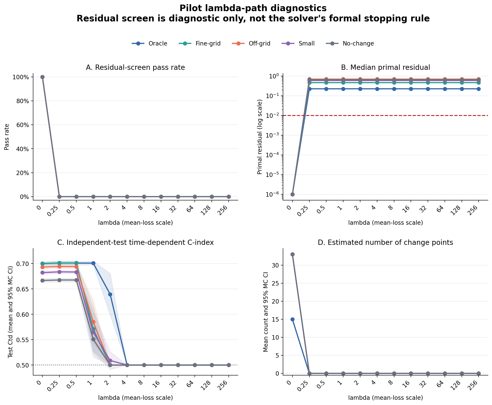
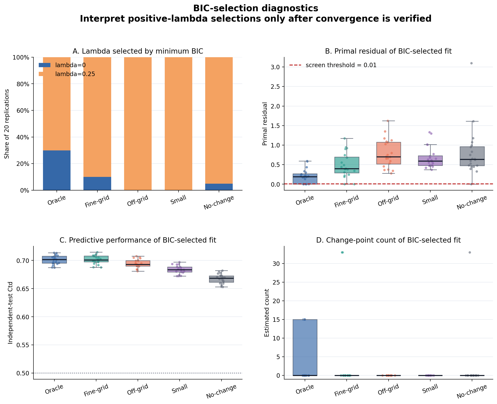
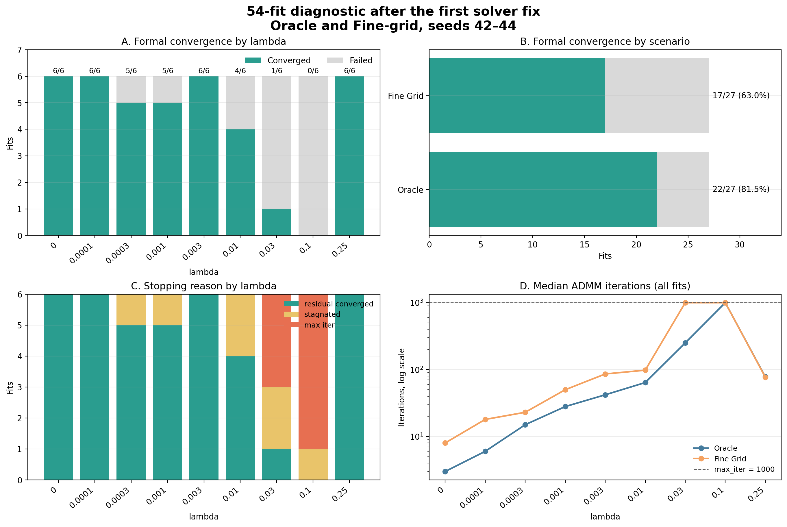

# パイロットシミュレーションの分析・修正・再分析記録

## 1. この資料の目的

本資料は、2026年8月5日のゼミ議事録を起点として、時間変動係数を持つHazard-AFTモデルのパイロットシミュレーションについて、次の経緯を再現可能な形で記録するものである。

- どの研究上の問いから実験条件を決めたか
- 最初の実験結果のどこに異常を認めたか
- 集計CSVと個別の `result.json` をどのように使い分けて原因を調べたか
- 何を観測事実とし、そこから何を推論したか
- 推論に基づいてどのコードを修正したか
- 修正後の診断実験で何が改善し、何が未解決だったか
- 再分析を受けて、さらにどの修正を行ったか
- 現時点で何が確定し、何が次の検証待ちか

この記録で重要なのは、予測性能や変化点推定の結果を評価する前に、最適化が正式に収束し、同一反復の係数・補助変数・尤度・残差から評価値が作られていることを確認した点である。

### 1.1 最初に読む要約

最初のパイロットは、5シナリオ、各20データセット、12個のlambdaからなる1,200件である。集計上は独立評価データの \(C^{td}\) がOracleで約0.70となり、一見すると妥当に見えた。しかし、個別結果まで確認すると、正のlambda 1,100件はすべて1,000反復の上限に達しており、正式収束は0件だった。さらに836件は初期値を返し、lambda 4以上の700件は \(C^{td}=0.5\) になっていた。このため、当初のBICが正のlambdaを91/100データセットで選んだ結果は無効と判断した。

第1次修正後、OracleとFine-gridに絞った54件では正式収束が39/54件まで改善した。一方、lambda 0.03は1/6件、0.1は0/6件しか収束せず、Fine-grid全体も17/27件に留まった。反復履歴から、rho更新と停滞判定の順序、および生残差によるrhoの振動を原因候補として特定し、第2次修正を行った。現在の判断点は、第2次修正後の同じ54件が自動ゲートを通過するかである。

### 1.2 データ・結果・図の所在

以下を起点にすれば、この資料中の数値を元データまでたどれる。

| 種類 | 場所 | 内容 |
|---|---|---|
| 実験条件 | [`generation/pilot/`](../generation/pilot/) | 5シナリオ、診断用設定、lambdaグリッド |
| 最初の集計 | [`outputs/pilot_summary.csv`](../outputs/pilot_summary.csv) | 1,200 fittingを1行ずつ集約したCSV |
| 最初の個別結果 | `outputs/pilot/{scenario}_seed_{seed}/lambda_{lambda}/result.json` | 係数、\(z\)、反復履歴、停止理由、学習・評価CSVの場所 |
| 最初の可視化 | [`outputs/pilot_visualizations/`](../outputs/pilot_visualizations/) | lambda経路図、BIC選択図、図の集計表 |
| 第1次修正後の集計 | [`adaptive_rho_newton5_summary.csv`](../outputs/pilot_diagnostic/adaptive_rho_newton5_summary.csv) | Oracle/Fine-grid、seed 42–44、9 lambdaの54件 |
| 第1次修正後の判定 | [`adaptive_rho_newton5_gate.json`](../outputs/pilot_diagnostic/adaptive_rho_newton5_gate.json) | 39/54収束、総合 `passed=false` |
| 第1次修正後の個別結果 | `outputs/pilot_diagnostic/adaptive_rho_newton5/{scenario}_seed_{seed}/lambda_{lambda}/result.json` | 返却反復と残差許容誤差を含む詳細結果 |
| 第2次修正後の出力予定 | `outputs/pilot_diagnostic/adaptive_rho_normalized_newton5*` | 再実行後に作られる比較対象 |

たとえば、最初のOracle seed 42、lambda 0.25の結果は [`result.json`](../outputs/pilot/oracle_seed_42/lambda_0.25/result.json) にある。このファイルが記録する元データの絶対パスは次である。

```text
学習: /home/sagara/github/admm/data/pilot/train/oracle_seed_42.csv
評価: /home/sagara/github/admm/data/pilot/eval/oracle_seed_42.csv
```

同様に、第1次修正後のFine-grid seed 42、lambda 0.03は [`result.json`](../outputs/pilot_diagnostic/adaptive_rho_newton5/fine_grid_seed_42/lambda_0.03/result.json) から、学習データ `data/pilot/train/fine_grid_seed_42.csv` と独立評価データ `data/pilot/eval/fine_grid_seed_42.csv` を使用したことを確認できる。

> **ローカル保存上の注意:** 2026年8月19日現在、この作業環境には1,200件と54件の `result.json` はコピー済みだが、`data/pilot/train/` と `data/pilot/eval/` の生成CSV自体は存在しない。上記の絶対パスはリモート実行環境のものである。個別結果の監査はできるが、ローカルで再fittingする場合は学習・評価CSVもコピーするか、[`scripts/pilot/generate_data.sh`](../scripts/pilot/generate_data.sh) で再生成する必要がある。また、`outputs/pilot/` と `outputs/pilot_diagnostic/` は `.gitignore` 対象なので、別環境で読む場合は結果ディレクトリも明示的にコピーする。

## 2. 全体の流れ

```text
2026-08-05 ゼミ
  │
  ├─ Fine-grid / Off-grid / Small / No-change を評価する方針
  │
  ▼
生成器・独立評価・BIC自由度を修正
  │
  ▼
5シナリオ × 20反復 × 12 lambda = 1,200 fitting
  │
  ├─ 集計CSV: 正のlambdaで残差が大きい
  └─ result.json: 正のlambda 1,100件が全件 max_iter
  │
  ▼
第1次修正
  ├─ 返却反復とsummaryの整合
  ├─ 未収束結果をBICから除外
  ├─ 適応的rho
  └─ 小lambda診断実験と自動ゲート
  │
  ▼
Oracle / Fine-grid 各3 seed × 9 lambda = 54 fitting
  │
  ├─ 39/54正式収束
  ├─ 正則化経路の固定は解消
  └─ lambda=0.03, 0.1でrho振動・停滞
  │
  ▼
第2次修正
  ├─ 許容誤差で正規化した残差によるrho更新
  └─ rho変更時の停滞カウントリセット
  │
  ▼
新しい54件診断の実行・ゲート判定待ち
```

この流れを「見た値 → 判断 → 修正」に縮約すると次のようになる。

| 段階 | 実際に見た値 | その値からの判断 | 実施した対応 |
|---|---|---|---|
| 最初の集計CSV | 正のlambdaの残差screen合格0/1,100、BICは正のlambdaを91/100件で選択 | BICが未収束推定を有利に扱っている疑い | 全1,200件の個別JSONを確認 |
| 最初の個別JSON | 正のlambdaは0/1,100正式収束、全件1,000反復、836件が初期値返却 | lambda経路、返却反復、BIC入力が不整合 | 返却反復を明示し、未収束をBIC除外、適応的rhoを追加 |
| 第1次修正後の集計 | 39/54正式収束、初期値返却0、lambda経路変化あり | 第1次修正は有効だが、0.03と0.1に未解決問題 | 15件の失敗JSONの反復履歴を比較 |
| 停滞例 | rhoを1→2→4と更新しても停滞カウントが継続し22反復目で停止 | rho変更直後の探索を早期終了している | rho変更時に停滞カウントをリセット |
| 振動例 | Fine-grid seed 42、lambda 0.03でrho増加51回・減少46回、最終主残差比362.6 | 生残差の大小と正式停止までの距離が一致しない | 許容誤差で正規化した残差比でrhoを更新 |

## 3. 研究上の出発点

### 3.1 ゼミで確認された研究目的

[2026年8月5日の議事録](meeting_minutes_2026-08-05.md)では、提案法の価値を、予測性能の大幅な改善だけでなく、時間変動する効果を区分一定関数として表現し、変化を解釈可能にする点へ置く方針が確認された。

シミュレーションで確認すべき条件は次の5つであった。

| 条件 | 研究上の問い |
|---|---|
| Oracle | 真の変化点と解析グリッドが一致する理想条件で正しく推定できるか |
| Fine-grid | 細かい解析グリッド上で不要な境界が融合されるか |
| Off-grid | 真の変化点が解析グリッドからずれても性能が大きく悪化しないか |
| Small | 係数変化が小さい場合に変化を捉えられるか |
| No-change | 変化がない場合に偽の変化点を作らないか |

### 3.2 最初に必要だった実装上の前処理

当時の生成器では、真の係数関数を定義するグリッドと推定に使うグリッドが同一のものとして扱われていた。このままではFine-gridとOff-gridを意図どおり区別できない。

また、既存実験は学習データ上の時間依存C-indexである \(C^{td}\) を中心に評価しており、BICの自由度も補助変数 \(z\) の非ゼロ数だけで計算されていた。

そこで、実験に先立って次を修正した。

1. `stepwise_beta.true_time_grid` と `analysis_time_grid` を分離した。
2. 学習データとは独立な評価データを生成し、既存の `--eval-data` へ渡した。
3. BICの自由度を次式へ変更した。

\[
\mathrm{df}
=M+p+\#\{z_j\ne0\},
\]

ここで、\(M\) はベースライン基底数、\(p\) は特徴量数、最後の項は推定された非ゼロ差分数である。BICは

\[
\mathrm{BIC}
=2\,\mathrm{NLL}+\mathrm{df}\log n
\]

とした。

主な実装は次のファイルにある。

- [`generation/extended_aft_step_generator.py`](../generation/extended_aft_step_generator.py)
- [`generation/generate_extended_aft_step_datasets.py`](../generation/generate_extended_aft_step_datasets.py)
- [`run_lambda_experiment.sh`](../run_lambda_experiment.sh)
- [`admm/model_selection.py`](../admm/model_selection.py)
- [`scripts/aggregate_lambda_results.py`](../scripts/aggregate_lambda_results.py)

この段階はコミット `6962ce8` に記録されている。

## 4. 最初のパイロット実験

### 4.1 実験設計

最初からFine-grid幅0.25、\(n=500\)、ランダム打ち切りまで広げるのではなく、まず基本設定が成立するかを確認するパイロットを行った。

- シナリオ：Oracle、Fine-grid、Off-grid、Small、No-change
- 反復数：各20
- 標本サイズ：\(n=1000\)
- 打ち切り：管理打ち切りのみ
- 学習データと独立評価データ：各反復でペア生成
- lambda：`0, 0.25, 0.5, 1, 2, 4, 8, 16, 32, 64, 128, 256`
- fitting数：\(5\times20\times12=1200\)

シナリオのグリッドは次のように設定した。

| シナリオ | 真のグリッド | 解析グリッド |
|---|---|---|
| Oracle | 0から6まで幅1 | 真のグリッドと同じ |
| Fine-grid | 0から6まで幅1 | 0から6まで幅0.5 |
| Off-grid | `0, 1.3, 2.3, 3.2, 4.2, 6.0` | 0から6まで幅0.5 |
| Small | 0から6まで幅1、小さい係数変化 | 0から6まで幅0.5 |
| No-change | `0, 6.0`、全期間一定 | 0から6まで幅0.5 |

設定とSGE実行入口はコミット `2a39560` で追加した。

### 4.2 集計CSVで最初に観測したこと

入力は [`outputs/pilot_summary.csv`](../outputs/pilot_summary.csv) で、1,200行、100データセット、12 lambdaがすべて揃っていた。

最初は、正式なADMM停止条件の代替ではないことを明示した上で、主残差と双対残差がともに0.01以下かを保守的な診断スクリーンとした。

観測結果は次のとおりであった。

| 対象 | 診断スクリーン合格 |
|---|---:|
| \(\lambda=0\) | 100/100 |
| \(\lambda>0\) | 0/1,100 |
| BICが選択した正のlambda | 0/91 |

一方、当時のBICは100データセット中91件で \(\lambda=0.25\) を、9件で \(\lambda=0\) を選択していた。

この組合せは不自然であった。BICは正のlambdaを高頻度で選ぶ一方、その推定値は残差診断を1件も通っていなかったからである。

可視化は次に保存した。

- [`pilot_lambda_diagnostics.png`](../outputs/pilot_visualizations/pilot_lambda_diagnostics.png)
- [`pilot_bic_selected_diagnostics.png`](../outputs/pilot_visualizations/pilot_bic_selected_diagnostics.png)
- [`pilot_visualization_report.md`](../outputs/pilot_visualizations/pilot_visualization_report.md)

#### 図1：最初のlambda経路



図1は [`pilot_summary.csv`](../outputs/pilot_summary.csv) を直接集計したものである。各パネルの意味と、実際に観測された値は次のとおりである。

- **A：残差スクリーン合格率。** lambda 0は100/100件、正のlambdaは0/1,100件だった。ここでの0.01閾値は初期診断用であり、正式停止判定は後に `result.json` の許容誤差を用いて行った。
- **B：主残差。** 正のlambdaの全11点で、全シナリオをまとめた中央値は0.546586と同じだった。赤い破線の0.01を大きく上回り、lambdaを変えても経路が動いていない疑いが生じた。
- **C：独立評価 \(C^{td}\)。** lambda 0、0.25、0.5では約0.67–0.70に見えるが、lambda 1以降で悪化し、lambda 4以上は全700件で0.5だった。
- **D：推定変化点数。** lambda 0の平均は29.4、正のlambdaはすべて平均0だった。ただし、主残差が大きいため、これは「係数が正しく融合された」のではなく、「補助変数 \(z\) が0から動かなかった」可能性を示す値だった。

全シナリオをまとめた代表値をCSVから抜き出すと、図の折れ方を数値でも確認できる。

| lambda | 平均 \(C^{td}_{test}\) | 変化点数平均 | 主残差中央値 | 解釈 |
|---:|---:|---:|---:|---|
| 0 | 0.688496 | 29.4 | 0.000000 | penaltyなし。残差スクリーンは100/100合格 |
| 0.25 | 0.689593 | 0.0 | 0.546586 | 予測値だけはlambda 0に近いが未収束 |
| 0.5 | 0.689471 | 0.0 | 0.546586 | 0.25と同じ残差経路 |
| 1 | 0.594670 | 0.0 | 0.546586 | 初期値返却が増え、予測性能が低下 |
| 2 | 0.529707 | 0.0 | 0.546586 | 0.5へ接近 |
| 4–256 | 0.500000 | 0.0 | 0.546586 | 700/700件が無情報予測 |

#### 図2：当時のBIC選択結果



図2のAでは、Oracleで14/20、Fine-gridで18/20、Off-gridで20/20、Smallで20/20、No-changeで19/20がlambda 0.25を選んでいる。合計91/100件である。一方、図2のBでは、正のlambdaが選ばれた91件はすべて残差0.01の線を上回った。図2のCだけを見るとシナリオ順に妥当な予測性能差があり、Dでは多くが変化点0に見えるが、Bの未収束を踏まえるとCとDをモデル選択性能として解釈できない。

図2に対応する実際のシナリオ別集計は次である。`screen pass rate` にはlambda 0を選択したデータセットも含まれるため、Oracle 30%、Fine-grid 10%、No-change 5%となる。一方、**BICが選択した正のlambdaに限定すると合格は0/91件**である。

| シナリオ | BIC選択lambda中央値 | 平均 \(C^{td}_{test}\) | 平均変化点数 | 主残差中央値 | screen合格率 |
|---|---:|---:|---:|---:|---:|
| Oracle | 0.25 | 0.7011 | 4.50 | 0.1897 | 30.0% |
| Fine-grid | 0.25 | 0.7015 | 3.30 | 0.3955 | 10.0% |
| Off-grid | 0.25 | 0.6942 | 0.00 | 0.7019 | 0.0% |
| Small | 0.25 | 0.6837 | 0.00 | 0.5948 | 0.0% |
| No-change | 0.25 | 0.6677 | 1.65 | 0.6382 | 5.0% |

### 4.3 この時点で安全に読めた予測性能

診断上問題が少なかった \(\lambda=0\) に限定すると、独立評価データ上の平均 \(C^{td}\) は次のとおりであった。

| シナリオ | 平均 \(C^{td}_{test}\) | 標準偏差 | 非ゼロ差分数の平均 |
|---|---:|---:|---:|
| Oracle | 0.7003 | 0.0070 | 15 |
| Fine-grid | 0.6999 | 0.0067 | 33 |
| Off-grid | 0.6932 | 0.0078 | 33 |
| Small | 0.6822 | 0.0071 | 33 |
| No-change | 0.6668 | 0.0080 | 33 |

OracleとFine-gridの予測性能は近かった。しかし、\(\lambda=0\) では全隣接差分が非ゼロとして数えられており、これは「Fine-gridで不要な境界が融合された」ことを示さない。したがって、この表から言えるのはpenaltyなしモデルの予測性能だけであり、fused lassoの変化点回復性能ではないと判断した。

## 5. 個別のresult.jsonによる正式な収束確認

### 5.1 なぜ集計CSVだけでは不十分だったか

当初の集計CSVには最終残差はあったが、次の情報が不足していた。

- `stopping_reason`
- `n_admm_iter`
- 各反復の主・双対許容誤差
- best iterateの位置
- 実際に返却された係数とどの反復が対応するか

そこで、1,200件すべての `result.json` を確認した。

### 5.2 正式な停止判定の結果

| 条件 | 停止理由 | 反復数 | 正式収束 |
|---|---|---:|---:|
| \(\lambda=0\)、100件 | `residual_converged` | 中央値22、範囲2–50 | 100/100 |
| \(\lambda>0\)、1,100件 | `max_iter` | 全件1,000 | 0/1,100 |

正のlambdaでは、主残差を正式な主許容誤差で割った比の中央値が約492、最小でも約251であった。双対残差が0でも、主制約

\[
D\beta-z=0
\]

が満たされていないため、収束とは判断できない。

具体例として、[`outputs/pilot/oracle_seed_42/lambda_0.25/result.json`](../outputs/pilot/oracle_seed_42/lambda_0.25/result.json) は独立評価 \(C^{td}=0.697369\) を記録している。この値だけなら妥当に見えるが、同じファイルの実際の最適化指標は次の状態だった。

| 指標 | 実際の値 |
|---|---:|
| `stopping_reason` | `max_iter` |
| `n_admm_iter` | 1,000 |
| `neg_loglik_last` | 1543.729357 |
| `primal_residual_last` | 0.173598 |
| `primal_tolerance_last` | 0.000561 |
| 主残差比 | 約309.5 |
| `dual_residual_last` | 0.000000 |
| 実効lambda | \(1000\times0.25=250\) |

つまり、この1件だけでも「予測指標が約0.70」「双対残差が0」と「ADMMが収束した」は同義でないことが分かる。正式な判定には主残差と双対残差をそれぞれの許容誤差と比較する必要があった。

### 5.3 lambda経路が実際には生成されていなかった

各データセット内で、11個の正のlambdaに対する主残差と負の対数尤度の反復履歴は完全に同一であった。また、正のlambda 1,100件では全反復を通じて双対残差の最大値が0だった。

当時の実装では

\[
\lambda_{\mathrm{effective}}=n\lambda
\]

としていたため、最小の正のlambda 0.25でも、\(n=1000,\rho=1\) ではsoft-thresholdingの閾値が250になる。これにより \(z\) が0から動かず、異なるlambdaで同じADMM経路を進んでいた。

lambdaごとに結果が異なって見えたのは、反復経路そのものが異なるからではなく、同じ経路上で「目的関数が最小」と判定された反復がlambdaによって異なったためであった。

### 5.4 初期値返却とsummary不整合

`return_best_iterate=true` の下で、正のlambda 1,100件中836件では `best_iter` が存在せず、初期値が返却されていた。

| lambda | 初期値返却 |
|---:|---:|
| 1 | 51/100 |
| 2 | 85/100 |
| 4以上 | 700/700 |

これがlambda 4以上で \(C^{td}=0.5\) に張り付いた直接的な理由であった。

さらに、当時の `result.json` は異なる反復の値を混在させていた。

- `coef` と `z_last`：best iterateまたは初期値
- `summary.neg_loglik_last` と `*_residual_last`：1,000反復目

BICは「最終反復の負の対数尤度」と「best iterateまたは初期値の \(z\) に基づく自由度」を組み合わせていた。したがって、91/100件で正のlambdaを選択したという最初のBIC結果は、モデル選択性能として解釈できないと判断した。

### 5.5 原因についての考察

観測された因果関係を次のように整理した。

```text
大きな正のlambda
  ↓
soft-thresholdingで z=0
  ↓
双対残差も0のまま
  ↓
一方、Dβ-z の主残差は大きい
  ↓
非ゼロz数が0となり、自由度が小さく見える
  ↓
未収束なのにBICが有利になる
```

ここで重要なのは、「変化点数0」という出力が、係数が正しく融合されたことを意味しなかった点である。\(z=0\) でも \(D\beta\ne z\) であれば、補助変数と係数が整合していない。

## 6. 第1次修正

上記の分析を受け、コミット `21d7b85` で次を修正した。

### 6.1 返却反復の明示

`result.json` に次を追加した。

- `returned_iter`
- `returned_from`
- `returned_objective`
- `returned_neg_loglik`
- `returned_primal_residual`
- `returned_dual_residual`
- `returned_primal_tolerance`
- `returned_dual_tolerance`
- `returned_rho`
- `converged`
- `bic_eligible`

正式収束時は必ず収束反復を返し、未収束時にbest iterateを返す場合も、その反復に対応する指標を明示するようにした。初期値しかbestにならない場合は、初期値を推定結果としてbest返却せず、最終反復を失敗結果として返すよう変更した。

### 6.2 BIC候補の制限

BICを計算する条件を次のすべてを満たす場合に限定した。

1. `converged=true`
2. 返却反復の主残差が主許容誤差以下
3. 返却反復の双対残差が双対許容誤差以下
4. 返却反復の負の対数尤度が利用可能

未収束結果は保存するが、BICは欠損とし、自動的に別候補へ読み替えない方針とした。

旧形式の1,200件を新しい集計処理で再集計すると、BIC候補になったのは正式収束した \(\lambda=0\) の100件だけで、`max_iter` の1,100件はすべて除外された。

### 6.3 適応的rho

主残差が双対残差より大きい場合に \(\rho\) を増加させ、逆の場合に減少させるresidual balancingを導入した。scaled dual変数 \(u\) は

\[
u\leftarrow u\frac{\rho_{\mathrm{old}}}{\rho_{\mathrm{new}}}
\]

として補正した。

第1次実装では、生の主残差と双対残差を比較していた。

### 6.4 小lambda診断実験

元のlambdaグリッドは0の次が0.25で粗かったため、次の9点へ変更した診断実験を用意した。

\[
0,\ 10^{-4},\ 3\times10^{-4},\ 10^{-3},\ 3\times10^{-3},
10^{-2},\ 3\times10^{-2},\ 0.1,\ 0.25.
\]

診断条件は次のとおりである。

- Oracle、Fine-grid
- 各3 seed、42–44
- 9 lambda
- 合計54 fitting
- `adaptive_rho=true`
- `newton_steps_per_admm=5`
- `rho_update_interval=5`

また、[`scripts/pilot/check_diagnostic.py`](../scripts/pilot/check_diagnostic.py) を追加し、次を自動ゲートとした。

- 54件が完了している
- 全件が正式収束している
- 返却残差が許容誤差内にある
- 返却反復が欠けていない
- 初期値フォールバックがない
- 各データセットにBIC候補がある
- lambdaによって正則化経路が変化する

## 7. 第1次修正後の54件診断

### 7.1 ゲート結果

入力は次である。

- [`adaptive_rho_newton5_summary.csv`](../outputs/pilot_diagnostic/adaptive_rho_newton5_summary.csv)
- [`adaptive_rho_newton5_gate.json`](../outputs/pilot_diagnostic/adaptive_rho_newton5_gate.json)
- 個別の `outputs/pilot_diagnostic/adaptive_rho_newton5/**/result.json`

ゲート結果は次のとおりであった。

| 項目 | 結果 |
|---|---:|
| 完了 | 54/54 |
| 正式収束 | 39/54、72.2% |
| BIC使用可能 | 39/54 |
| 初期値返却 | 0 |
| 全データセットにBIC候補 | 合格 |
| 正則化経路がlambdaで変化 | 合格 |
| 総合判定 | 不合格 |

第1次修正により、正のlambda全件が同一経路を進む問題と、初期値を推定結果として返す問題は解消した。一方、全件正式収束という条件は満たさなかった。

### 7.2 lambda別・シナリオ別収束率

| lambda | 収束数 |
|---:|---:|
| 0 | 6/6 |
| 0.0001 | 6/6 |
| 0.0003 | 5/6 |
| 0.001 | 5/6 |
| 0.003 | 6/6 |
| 0.01 | 4/6 |
| 0.03 | 1/6 |
| 0.1 | 0/6 |
| 0.25 | 6/6 |

シナリオ別ではOracleが22/27、Fine-gridが17/27であった。解析区間が6から12へ増え、差分数が15から33へ増えるFine-gridの方が不安定だった。

未収束15件の停止理由は次のとおりである。

- `stagnated`：7件
- `max_iter`：8件

失敗は主にlambda 0.03と0.1へ集中した。

| lambda | Oracle失敗 | Fine-grid失敗 |
|---:|---:|---:|
| 0.0003 | 0 | 1 |
| 0.001 | 0 | 1 |
| 0.01 | 0 | 2 |
| 0.03 | 2 | 3 |
| 0.1 | 3 | 3 |

#### 図3：第1次修正後に、どのlambdaで失敗したか



図3は [`adaptive_rho_newton5_summary.csv`](../outputs/pilot_diagnostic/adaptive_rho_newton5_summary.csv) の54行から作成した。再生成コマンドは次である。

```bash
.venv/bin/python scripts/pilot/visualize_diagnostic_results.py
```

- **A：lambda別の正式収束数。** lambda 0、0.0001、0.003、0.25は6/6件だった。これに対し0.03は1/6件、0.1は0/6件であり、失敗が中間lambdaへ局在している。
- **B：シナリオ別の正式収束数。** Oracleは22/27件、81.5%であるのに対し、Fine-gridは17/27件、63.0%だった。解析グリッドが細かく差分変数が増える条件で悪化している。
- **C：停止理由。** 未収束15件の内訳は `stagnated` 7件と `max_iter` 8件である。特にlambda 0.1は収束0、`stagnated` 1、`max_iter` 5だった。
- **D：反復数中央値。** Fine-gridはlambda 0.03と0.1でともに1,000反復、Oracleも0.1で1,000反復だった。一方、lambda 0.25はFine-grid 77反復、Oracle 78反復で収束している。lambdaが大きいほど単調に難しくなるのではなく、active setが切り替わる中間領域に問題があることを視覚的に示す。

この図から得た修正方針は、「一律に最大反復数を増やす」ことではなかった。0.25は短い反復で解けており、0.03と0.1だけでrho更新が振動していたため、次節では失敗した個別 `result.json` の反復履歴を調べた。

lambda 0.25は6/6収束したが、全件で変化点数0だった。これは \(z=0\) の等式制約問題となり、rhoが一方向に増加する比較的単純な経路だったためと考えた。

一方、lambda 0.03と0.1では \(z\) のactive setが切り替わり、双対残差が断続的に発生していた。

### 7.3 停滞停止の分析

当時の停滞判定は、係数更新と目的関数変化が小さく、両残差が許容誤差の10倍以内である状態が10反復続くと停止するものだった。

しかし、停滞停止は適応的rhoの更新より先に評価され、rhoを変更しても停滞カウントをリセットしていなかった。

代表例はFine-grid seed 44、lambda 0.0003である。元の反復履歴は [`result.json`](../outputs/pilot_diagnostic/adaptive_rho_newton5/fine_grid_seed_44/lambda_0.0003/result.json) にある。

| 反復 | rho更新 | 主残差比 |
|---:|---|---:|
| 15 | 1から2 | 5.85 |
| 20 | 2から4 | 5.85 |
| 22 | `stagnated` | 5.85 |

25反復目まで進めば、次のrho更新を試せた可能性がある。したがって、7件の `stagnated` は、最適化不能というより適応更新直後の早期停止である可能性が高いと考えた。

この例の22反復目の主残差は0.012013、主許容誤差は0.002052で、比は5.85だった。`stagnation_count` は、15反復目と20反復目にrhoを変更した後も継続し、22反復目に10へ達して停止した。また、目的関数上のbestとして返されたのは4反復目で、返却主残差0.250322、返却主許容誤差0.002052、比約122だった。このため、停止直前の状態だけでなく、実際に返した推定値もBIC不適格と正しく判定された。

### 7.4 rho振動の分析

`max_iter` の8件ではrhoが頻繁に増減していた。

例としてFine-grid seed 42、lambda 0.03では、1,000反復中にrho増加が51回、減少が46回あり、最終rhoは32、最終主残差比は約363だった。個別値は [`result.json`](../outputs/pilot_diagnostic/adaptive_rho_newton5/fine_grid_seed_42/lambda_0.03/result.json) にある。

| 指標 | 最終反復の実際の値 | 許容誤差比 |
|---|---:|---:|
| 主残差 | 0.438850 | \(0.438850/0.001210=362.6\) |
| 双対残差 | 8.695929 | \(8.695929/0.087226=99.7\) |
| rho | 32 | — |
| 停止理由 | `max_iter` | — |

Fine-grid seed 42、lambda 0.1でも、rho増加78回、減少71回、最終主残差比約136だった。

原因を反復履歴から調べると、生の残差を比較するrho更新と、許容誤差で規格化された正式停止条件の方向が一致していない場面があった。

ある反復では

\[
\frac{r}{\epsilon_{\mathrm{pri}}}=189,
\qquad
\frac{s}{\epsilon_{\mathrm{dual}}}=27.8
\]

で、正式停止までの距離は主残差側の方が大きかった。それにもかかわらず、生の双対残差が大きいためrhoを32から16へ減少させていた。

これはrhoを増やす反復と減らす反復の往復を生み、特にactive setが変化する中間lambdaで収束を妨げたと推論した。

### 7.5 この段階のBICを確定結果にしなかった理由

39件の収束候補だけでBICを選ぶと次の結果だった。

| データ | 選択lambda | 変化点数 |
|---|---:|---:|
| Fine-grid seed 42 | 0.25 | 0 |
| Fine-grid seed 43 | 0.25 | 0 |
| Fine-grid seed 44 | 0.25 | 0 |
| Oracle seed 42 | 0.01 | 14 |
| Oracle seed 43 | 0.25 | 0 |
| Oracle seed 44 | 0.03 | 4 |

Fine-gridではlambda 0.03と0.1が全件未収束でBIC候補から欠落していた。したがって、lambda 0.25が選ばれたことを、真に最良のモデルが定数係数だったという結果にはできない。候補集合が不完全なため、BIC比較は診断用に留めた。

## 8. 第2次修正

第1次修正後の再分析を受け、コミット `7069758` で次の2点を変更した。

### 8.1 許容誤差で正規化したresidual balancing

rho更新に用いる残差を

\[
r_{\mathrm{norm}}
=\frac{r}{\epsilon_{\mathrm{pri}}},
\qquad
s_{\mathrm{norm}}
=\frac{s}{\epsilon_{\mathrm{dual}}}
\]

とした。更新規則は

\[
\begin{aligned}
r_{\mathrm{norm}}>\mu s_{\mathrm{norm}}
&\Rightarrow \rho\leftarrow\tau_{\mathrm{inc}}\rho,\\
s_{\mathrm{norm}}>\mu r_{\mathrm{norm}}
&\Rightarrow \rho\leftarrow\rho/\tau_{\mathrm{dec}}
\end{aligned}
\]

である。診断設定では \(\mu=10\)、\(\tau_{\mathrm{inc}}=\tau_{\mathrm{dec}}=2\) を維持した。

この変更により、rho更新の判断基準と正式停止条件が同じスケールになる。

### 8.2 rho更新を停滞停止より優先

反復内の順序を次へ変更した。

1. 正式な主・双対残差収束を確認する。
2. 適応的rhoの更新条件を確認する。
3. rhoが実際に変わった場合はscaled dual変数を補正する。
4. `stagnation_count` を0へ戻す。
5. rhoが変わらなかった場合に限り、停滞停止を評価する。

rhoが上限または下限に達して実際には変わらない場合は、停滞カウントをリセットしない。

実装は [`admm/solver.py`](../admm/solver.py) にあり、次の再現テストを追加した。

- 生の残差と正規化残差でrho更新方向が逆になるケース
- rho更新後に停滞停止せず、正式収束まで進むケース
- scaled dual補正と返却反復の既存テスト

### 8.3 結果ディレクトリの分離

第1次診断を上書きしないよう、新しい既定run名を

```text
adaptive_rho_normalized_newton5
```

へ変更した。

## 9. 第2次修正後の54件診断

入力は次である。

- [`adaptive_rho_normalized_newton5_summary.csv`](../outputs/pilot_diagnostic/adaptive_rho_normalized_newton5_summary.csv)
- [`adaptive_rho_normalized_newton5_gate.json`](../outputs/pilot_diagnostic/adaptive_rho_normalized_newton5_gate.json)
- 個別の `outputs/pilot_diagnostic/adaptive_rho_normalized_newton5/**/result.json`

正式収束は第1次修正後の39/54件から53/54件へ改善した。Oracleは22/27件から27/27件、Fine-gridは17/27件から26/27件となり、`max_iter` は8件から0件へ減った。特にlambda 0.03は1/6件から6/6件、lambda 0.1は0/6件から6/6件へ改善し、問題だったrhoの増減振動も大幅に減少した。

残った未収束はFine-grid seed 42、lambda 0.003の1件だけである。個別結果は [`result.json`](../outputs/pilot_diagnostic/adaptive_rho_normalized_newton5/fine_grid_seed_42/lambda_0.003/result.json) にある。

| 指標 | 最終56反復目 | 返却された6反復目 |
|---|---:|---:|
| 主残差比 | ほぼ0 | 530.16 |
| 双対残差比 | 2.00 | 34.05 |
| rho | 32 | 2 |
| 停止理由 | `stagnated` | `best_iterate` |

56反復目はrho更新間隔5の周期外だった。主残差がほぼ0となって双対残差側が優勢になった直後、次の60反復目のrho更新を待たずに停滞カウントが10へ達して停止していた。したがって、第2次修正の方向は有効だが、周期更新と毎反復の停滞停止との間に残る早期停止と判断した。

## 10. 第3次修正

停滞上限へ達した場合は、通常の更新周期外でもrho balancingを一度評価するよう変更した。

1. 正式な残差収束を最初に確認する。
2. 通常のrho更新周期、または停滞上限到達のどちらかでbalancingを評価する。
3. rhoを変更できた場合はscaled dual変数を補正し、停滞カウントを0へ戻して継続する。
4. rhoを変更できない場合だけ `stagnated` として停止する。

履歴には、通常周期による評価か停滞回避による評価かを区別する `rho_update_trigger` を追加した。値は `interval`、`stagnation_escape`、`none` のいずれかである。

また、第2次診断を上書きしないよう、新しい既定run名を次へ変更した。

```text
adaptive_rho_normalized_stagnation_escape_newton5
```

回帰テストでは、通常周期外で停滞上限へ達した際にrhoを変更して正式収束へ進むケースと、rho上限のため変更できず従来どおり停滞停止するケースの両方を確認した。

## 11. 現在の到達点

2026年8月19日時点の状態は次のとおりである。

### 確定したこと

1. 真の係数グリッドと解析グリッドは分離された。
2. 独立評価データ上の \(C^{td}\) を利用できる。
3. BIC自由度はベースライン、特徴量の初期レベル、変化点数を含む。
4. 係数、\(z\)、尤度、残差は返却反復を明示して保存される。
5. 未収束結果はBIC候補から除外される。
6. 初期値を推定結果としてbest返却する問題は解消した。
7. 小lambdaを使えば、lambdaによって異なる正則化経路が生成される。
8. 第1次の適応的rhoで39/54件まで正式収束率が改善した。
9. 第2次修正により53/54件が正式収束し、lambda 0.03と0.1は全件収束した。
10. 残る1件を、rho更新周期直前の停滞停止として特定した。
11. 第3次修正で停滞時の周期外rho balancingを追加した。

### まだ確定していないこと

1. 第3次修正後の54件が全件正式収束するか。
2. 完全な候補集合の下でBICがどのlambdaを選ぶか。
3. Fine-gridで不要な境界が正しく融合されるか。
4. Off-grid、Small、No-changeを含む各20反復の性能。
5. 係数関数のRMISE、変化点precision/recall、位置誤差。

したがって、現時点では最初の1,200件から手法性能を結論づけず、第3次修正後の診断ゲート通過を次の判断点とする。

## 12. 次の実行と合格条件

リモートでは次を実行する。

```bash
./scripts/pilot/submit_diagnostic.sh
```

完了後に集計とゲート判定を行う。

```bash
./scripts/pilot/aggregate_diagnostic.sh
```

新しい出力先は次である。

```text
outputs/pilot_diagnostic/adaptive_rho_normalized_stagnation_escape_newton5/
outputs/pilot_diagnostic/adaptive_rho_normalized_stagnation_escape_newton5_summary.csv
outputs/pilot_diagnostic/adaptive_rho_normalized_stagnation_escape_newton5_gate.json
```

本パイロットへ進む条件は次のすべてである。

- 54/54件が完了
- 54/54件が `residual_converged`
- 返却主残差比と双対残差比がともに1以下
- 初期値フォールバックなし
- 各データセットにBIC候補あり
- 小から中lambdaで正則化経路が変化
- 係数、\(z\)、尤度、残差、BICが同じ返却反復に対応

不合格の場合は、複数パラメータを同時に変えず、次の順で原因を切り分ける。

1. `rho_balance_mu` と `rho_update_interval` を比較する。
2. `newton_steps_per_admm` を5から10へ増やす。
3. line searchの失敗頻度を確認し、必要なら最大縮小回数を増やす。
4. 失敗lambdaだけを再実行し、収束例を回帰対照として含める。

## 13. 監査証跡

| コミット | 内容 |
|---|---|
| `6962ce8` | 真のグリッドと解析グリッドの分離、独立評価データ、BIC自由度修正 |
| `2a39560` | 5シナリオのパイロット設定とSGE実行スクリプト |
| `21d7b85` | 返却反復整合、未収束BIC除外、適応的rho、小lambda診断とゲート |
| `7069758` | 正規化残差によるrho更新、rho変更時の停滞カウントリセット |

主要な検証テストは次である。

- [`tests/test_extended_aft_step_generator.py`](../tests/test_extended_aft_step_generator.py)
- [`tests/test_main_eval_data_cli.py`](../tests/test_main_eval_data_cli.py)
- [`tests/test_model_selection_bic.py`](../tests/test_model_selection_bic.py)
- [`tests/test_solver_lambda_scaling.py`](../tests/test_solver_lambda_scaling.py)
- [`tests/test_solver_adaptive_rho.py`](../tests/test_solver_adaptive_rho.py)
- [`tests/test_pilot_diagnostic_gate.py`](../tests/test_pilot_diagnostic_gate.py)

なお、全体テストには `outputs/result.json` を前提とする既存のpredict-onlyテストがあり、そのファイルがない環境では1件失敗する。この失敗は今回のADMM・BIC修正とは独立である。

## 14. この経緯から得られた方法論上の教訓

1. **予測指標だけで最適化の成功を判断しない。** \(C^{td}\) が妥当な値でも、ADMM制約が未収束である場合がある。
2. **双対残差0だけでは収束ではない。** \(z\) が動かず、主残差が残る場合がある。
3. **BICは入力された推定値の数値的妥当性に依存する。** 未収束の \(z=0\) は自由度を過小評価し、BICを人工的に小さくする。
4. **返却反復を明示する。** best iterateを返すなら、尤度・残差・許容誤差も同じ反復から取得する必要がある。
5. **チューニング経路そのものを検査する。** lambdaが違っても反復履歴が同一なら、正則化経路を評価したことにならない。
6. **大規模実験の前に小規模な自動ゲートを置く。** 54件の診断により、1,200件を再実行する前に残る数値問題を発見できた。
7. **修正後も結論を急がない。** 39/54件への改善は成果だが、候補lambdaが欠けたBICを最終結果にはしなかった。
8. **停止条件と適応更新の尺度をそろえる。** 正式停止が許容誤差比で決まるなら、rho調整も同じ尺度で判断する方が整合的である。
