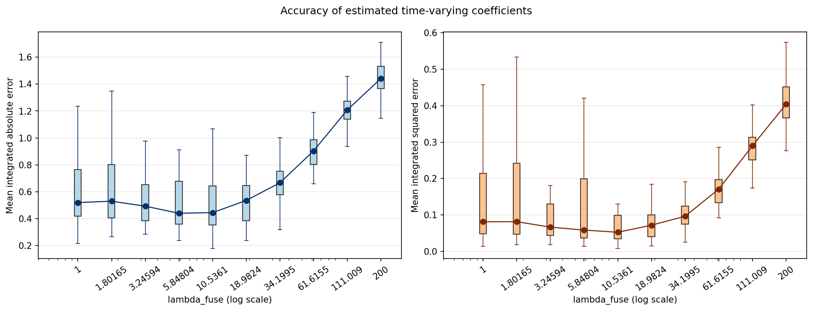

# 進捗報告（2026/04/30）

---
<!-- _header: 前回の振り返り -->

### $C^{td}$ による評価結果と Cox 回帰との比較
- Cox回帰の$C^{td}$と比較して性能改善は見られるが差が小さい
提案手法のメリットとはならない
- 提案法は Pang 法の改善ではなく，別方向の提案として位置づける
- fused lasso の役割は，係数の時間変化を滑らかに推定することではなく，
変化点を捉えやすくすること。そのため，提案法の売りは以下とする
  - 時間変動係数の区分一定表現
  - 変化点の抽出
  - 係数変化の解釈しやすさ

---
<!-- _header: 前回の振り返り -->

### 前回整理した主なタスク：研究・実装

- シミュレーション設定の見直し、提案法の特徴が出やすい設定を作る
  - 係数の振れ幅を大きくする
- 比較対象モデルの追加
  - 時間不変 AFT
  - penalty なしの時間変動 AFT
  - 可能なら Pang 法
- $C^{td}$ は訓練データではなく，テストデータで評価する
- 予測性能だけでなく，係数関数の推定精度も評価する
  - 真の係数関数との L1 距離
  - 真の係数関数との L2 距離
- 提案法の特徴を評価するため，変化点検出性能の指標も検討する

---

## 前回整理した主なタスク：論文化

- Introduction の整理
  - AFT モデルの位置づけ
  - Pang 法の位置づけ
  - change-point / fused lasso 系の関連研究
  - 本研究の新規性
- Methods の整理
  - 記号の統一
  - 時間分割の定義
  - 目的関数と ADMM の詳細
- 実データ解析の方針を検討する
  - 候補：心疾患発症データ
  - 時間区分数と $\lambda$ の選択法

---

## 今回報告する内容

  - シミュレーション設定の見直し、提案法の特徴が出やすい設定を作る
係数の振れ幅を大きくする
  - 係数関数推定精度の評価 
  - 実データでの評価
  
---
<!-- _header:  係数の振れ幅を大きくする -->
βの真値を変更（小さいほうの値にマイナスつけた）
| 項目 | 旧値 | 新値 | 
|---|---|---|
| beta1| 0.2, 0.2, 0.6, 0.6, 0.6, 0.6 | -0.2, -0.2, 0.6, 0.6, 0.6, 0.6 | 
| beta2 | 0.4, 0.4, 0.4, 0.4, 0.1, 0.1 | -0.4, -0.4, -0.4, -0.4, 0.1, 0.1 | 
| beta3 | 0.1, 0.5, 0.5, 0.3, 0.3, 0.3 | -0.1, 0.5, 0.5, -0.3, -0.3, -0.3 | 

結果は別途表示
Coxとの差異は拡大した

---
<!-- _header:  係数関数推定精度の評価 -->

** 推定された時間変動係数が真値に近いかを評価する**

- シミュレーションでは，真の係数関数 $\beta(t)$ が既知
- 提案法で得られる推定値 $\hat{\beta}(t)$ と真値を比較する
$$
\int |\hat{\beta}_j(t)-\beta_j(t)|dt
=\sum_{k=1}^{K}(t_k-t_{k-1})|\hat{\beta}_{jk}-\beta_{jk}|
$$

$$
\int \{\hat{\beta}_j(t)-\beta_j(t)\}^2dt
=\sum_{k=1}^{K}(t_k-t_{k-1})(\hat{\beta}_{jk}-\beta_{jk})^2
$$

- 複数の共変量がある場合は，これを $j=1,\dots,p$ について平均する

---
<!-- _header:  係数関数推定精度の評価 -->

別のモデルでの比較がないと何とも、、、

---
<!-- _header:  実データでの解析 -->

### 複数の実データで提案法を適用

- Framingham コホートデータ
  - 心血管疾患発症リスクに関するコホートデータ
  - 共変量効果が追跡時間により変化する可能性を検討する

- SUPPORT データ
  - 重症患者の予後に関する生存時間データ
  - 医療データにおける時間変動効果の解釈可能性を確認する

- MIMIC-IV
  - ICU 入室患者を対象とした大規模医療データ
  - 解析用データセットの入手を進めている途中
