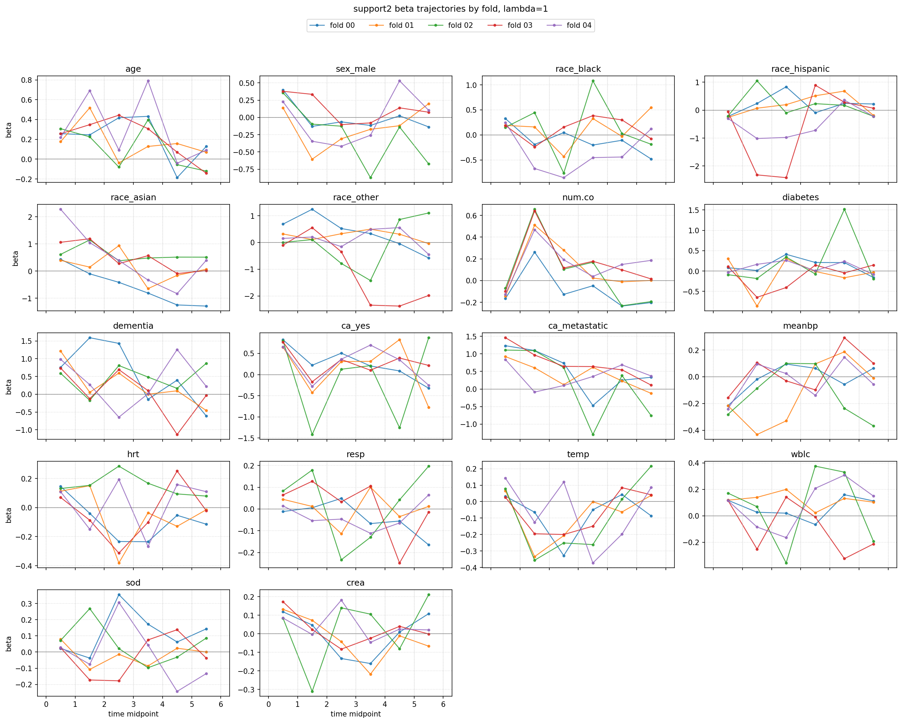
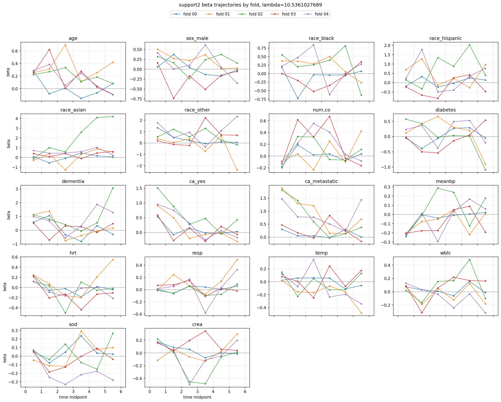
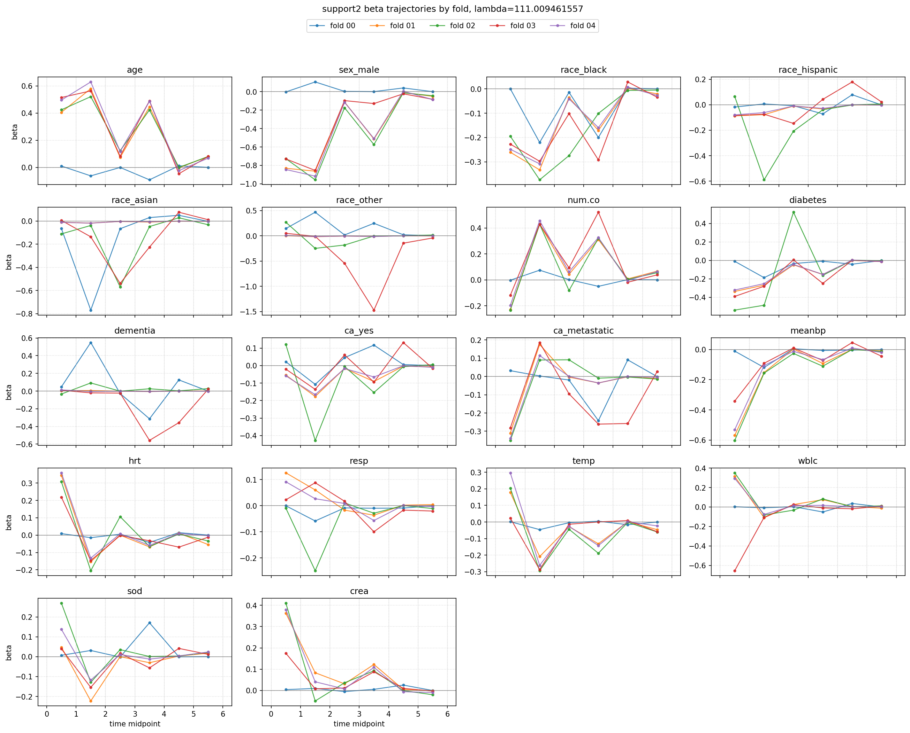
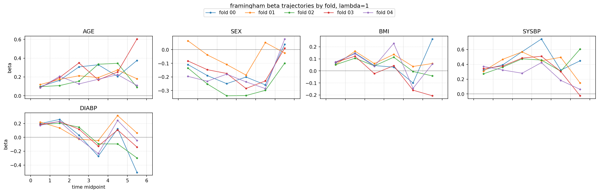

# 進捗報告（2026/05/20）

---
<!-- _header: 前回の振り返り -->

## 前回整理した主なタスク：論文化

- Introduction の整理
  - AFT モデルの位置づけ
  - Pang 法の位置づけ
  - change-point / fused lasso 系の関連研究
  - 本研究の新規性
- Methods の整理
  - 記号の統一
  - 時間分割の定義
  - 目的関数と ADMM の詳細
- 実データ解析の方針を検討する
  - 候補：心疾患発症データ
  - 時間区分数と $\lambda$ の選択法

---
<!-- _header:  今回報告する内容 -->
  - 実データでの評価
  - Cox 回帰との比較
  - 時間変動係数の解釈に向けた確認
  - MIMIC
  
---
<!-- _header:  複数の実データで提案法を適用 -->
- Framingham コホートデータ   実施ずみ
  - 心血管疾患発症リスクに関するコホートデータ
  - 共変量効果が追跡時間により変化する可能性を検討する

- SUPPORT データ　実施ずみ
  - 重症患者の予後に関する生存時間データ
  - 医療データにおける時間変動効果の解釈可能性を確認する

- MIMIC-IV　入手中（要相談）
  - ICU 入室患者を対象とした大規模医療データ
  - 解析用データセットの入手を進めている途中

---
<!-- _header:  実データ CV の設定 -->

| データ | 対象者数 | イベント数 | 共変量数 | 評価 |
|---|---:|---:|---:|---|
| Framingham | 2,996 | 2,181 | 5 | 5-fold CV |
| SUPPORT2 | 8,832 | 6,005 | 18 | 5-fold CV |

- 各 fold で train/test に分割し，test data の $C^{td}$ で評価
- $\lambda$ は同じ grid で比較
- Cox 比例ハザードモデルを同じ fold 分割で学習・評価し，基準線として重ねる

---
<!-- _header:  SUPPORT2：$\\lambda$ ごとの CV 性能 -->

### 

---
<!-- _header:  Framingham：$\\lambda$ ごとの CV 性能 -->

- どちらのデータでも，Cox 回帰に対する予測性能の改善は小さい
- 正則化強度を高めると、予測性能は悪化する。
- 提案法の主張は，予測精度の大幅改善ではなく，時間変動係数の表現と解釈性に置く

---
<!-- _header:  SUPPORT2：時間変動係数の確認 -->

---
<!-- _header:  SUPPORT2：時間変動係数の確認（$\\lambda  =10$） -->

---
<!-- _header:  SUPPORT2：時間変動係数の確認（$\\lambda \\simeq 111$） -->

---
<!-- _header:  SUPPORT2：考察 -->

- fold 間で係数軌跡のばらつきが大きい
- イベント発生がTime=0 近辺に集中しているため？

---
<!-- _header:  Framingham：時間変動係数の確認 -->

### 

- SUPPORT2 より共変量数が少なく，係数を確認しやすい
-  後半の区間でばらつきが大きいことは、シミュレーション時の同様の傾向

---
<!-- _header:  実データでの解析 -->

- 複数 fold で評価すると，提案法と Cox の $C^{td}$ はほぼ同水準
- 予測性能の改善を主張するには差が小さい
- 一方で，提案法では係数を時間区間ごとに推定できるため，
  リスク因子の効果がどの時点で変わるかを確認できる

---
<!-- _header:  今後の予定 -->

- 論文化
  - 実データ解析の位置づけを「予測性能」より「時間変動効果の解釈」に置く
  - Methods の記号と ADMM の説明を整理
  - Simulation では真の変化点・係数推定精度を主評価にする
