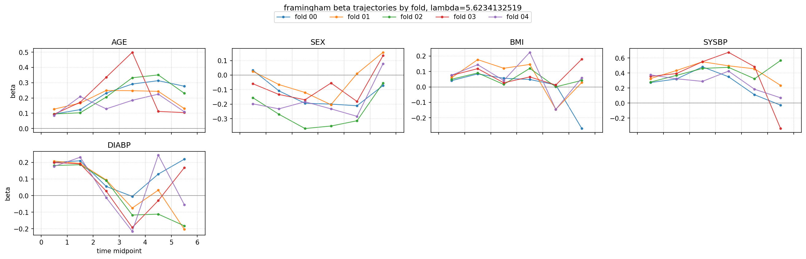
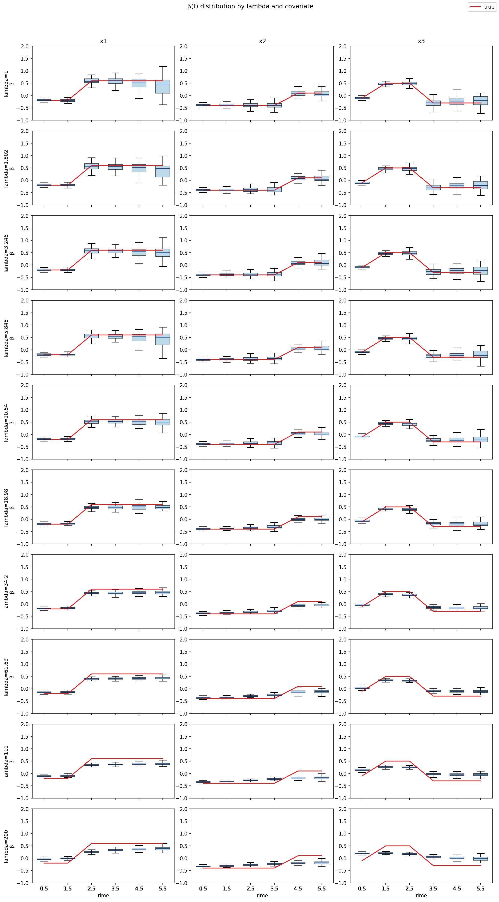

# 進捗報告（2026/06/10）

---
<!-- _header: 本日の内容 -->

- 前回会議の振り返り
- 正則化項のスケーリング修正後の再解析
  - SUPPORT2
  - Framingham
  - lambda experiments
- 結果の確認と今後の作業

---
<!-- _header: 前回会議での重要な指摘 -->

## $\lambda$ のスケーリング

- Fused Lasso 正則化を加えた対数尤度を，サンプルサイズ $N$ でスケーリングした

$$
\ell_{\text{lasso}}(\boldsymbol{\beta},\gamma)
:=
\frac{1}{N}\log L(\boldsymbol{\beta},\gamma)
- \lambda_{\text{fuse}}
\sum_{j=1}^{p}\|D\boldsymbol{\beta}_j\|_1
$$

- これにより，尤度部分と正則化項のスケールを揃えた
- この指摘を踏まえて，SUPPORT2 / Framingham / lambda experiments を更新した

---
<!-- _header: 継続・追加タスク -->

- 論文化に向けた整理
  - Introduction / Methods / Simulation の整理
  - 実データ解析は時間変動効果の解釈を中心に据える
- 比較対象の追加
  - AFT モデル
  - penalty なしモデル
  - 可能であれば Pang 法
- MIMIC-IV 申請
- Overleaf は川野先生側でプロジェクトを作成し，共同編集する方向

---
<!-- _header: 再解析の概要 -->

- $\lambda$ のスケーリング修正後に解析を一通り更新した
- 実データ CV は SUPPORT2 / Framingham で再実行した
- 小さい $\lambda$ 側を追加した grid で比較した
- シミュレーションの lambda experiments も更新した
- 評価指標は test data の $C^{td}$ を中心に確認する

---
<!-- _header: SUPPORT2：$\\lambda$ ごとの CV 性能 -->

- 提案法の最良：$\lambda=1.0$，test $C^{td}=0.5996 \pm 0.0063$
- Cox 回帰：test $C^{td}=0.5986 \pm 0.0064$
- Cox との差はごく小さい
- $\lambda=1.0$ から $5.62$ 付近までは大きな差はない
- $\lambda$ をさらに大きくすると test $C^{td}$ は低下する

---
<!-- _header: SUPPORT2：train / test の比較 -->

- 小さい $\lambda$ では train / test の差は大きくない
- $\lambda$ を強くすると train / test ともに性能が低下する

---
<!-- _header: SUPPORT2：時間変動係数（$\\lambda=1$） -->

- 最良付近の $\lambda$ でも fold 間のばらつきが残る
- 後半区間ではイベント数・リスク集合の減少により推定が不安定になりやすい

---
<!-- _header: Framingham：$\\lambda$ ごとの CV 性能 -->

- 提案法の最良：$\lambda \simeq 5.62$，test $C^{td}=0.7081 \pm 0.0144$
- Cox 回帰：test $C^{td}=0.7077 \pm 0.0133$
- $\lambda$ による差は小さく，Cox との差も小さい

---
<!-- _header: Framingham：train / test の比較 -->

- train / test の $C^{td}$ はほぼ同水準
- $\lambda=1$ から $7.5$ 付近では性能差は小さい
- $\lambda=10$ では train / test の差が大きくなる
- 予測性能よりも，係数の時間変化をどう解釈するかが主な論点になる

---
<!-- _header: Framingham：時間変動係数（$\\lambda \\simeq 5.62$） -->

- SUPPORT2 より共変量数が少なく，係数軌跡を確認しやすい
- 後半区間では fold 間のばらつきが大きくなる傾向がある

---
<!-- _header: lambda experiments：推定された変化点数 -->

- 小さい $\lambda$ の grid を追加して確認する
