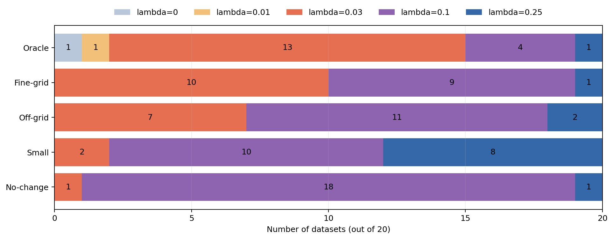
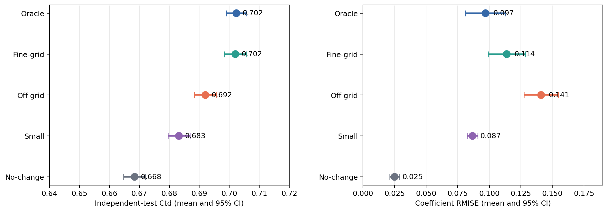
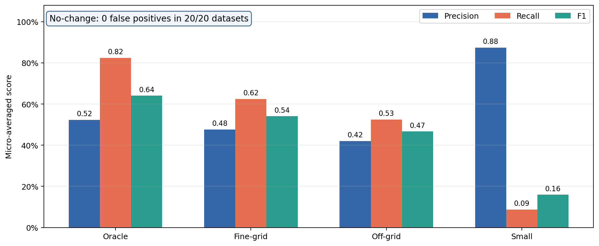

<!-- _class: lead -->

# 時間変動係数AFTモデル：進捗報告

### 2026/08/21

<!--
[Sources]
- docs/slides21_2026-08-05.md
- docs/meeting_minutes_2026-08-05.md
-->

---
<!-- _header: 前回ゼミ 課題設定-->

## 変化点を捉えられるか

提案法の主張を予測性能の大幅な改善ではなく、次の点に置いた。

**時間変動係数を区分一定で表現し、効果が変化する時点を捉えやすくする。**

提案法の評価を下記の３点にて行う

1. 不要な候補境界をfused lassoで融合できるか
2. 真の変化点がグリッド外でも係数推定はロバストか
3. 小さい変化を見逃さず、変化なしで偽陽性を増やさないか

> 真の変化点を厳密に推定するものではない。変化点がグリッド外でもロバストな推定が可能であることを目的とする。

<!--
[Sources]
- docs/meeting_minutes_2026-08-05.md sections 4, 5, 7, 10
-->

---
<!-- _header: シミュレーション設計 -->

##  効果が変化する時点を正しく捉えることができるか

| 設定 | 真の変化点 | 解析グリッド | 確認すること |
|---|---|---|---|
| Oracle | 境界と一致 | 幅1.0 | 理想条件での回復 |
| Fine-grid | 境界と一致 | 幅0.5 | 不要な境界の融合 |
| Off-grid | 1.3, 2.3, 3.2, 4.2 | 幅0.5 | グリッドずれへの頑健性 |
| Small | 境界と一致・変化量Fine-gridの半分 | 幅0.5 | 小変化の検出限界 |
| No-change | 変化なし | 幅0.5 | 偽変化点の抑制 |

<!--
[Sources]
- generation/pilot/oracle.json
- generation/pilot/fine_grid.json
- generation/pilot/off_grid.json
- generation/pilot/small.json
- generation/pilot/no_change.json
-->

---
<!-- _header: シミュレーション設計：テストパターン -->

## 真の変化点と解析グリッドの位置関係を5条件で比較する

  <i class="legend-grid"></i>解析グリッド境界
  <i class="legend-truth"></i>真の係数変化

  
設定

時間軸（0〜6）

この条件で検査すること

  
<b>Oracle</b> <small>幅1.0</small>

  

    <i class="truth-mark" style="left:16.667%"></i><i class="truth-mark" style="left:33.333%"></i><i class="truth-mark" style="left:50%"></i><i class="truth-mark" style="left:66.667%"></i>
  

  
真の変化点が候補境界と一致する理想条件

  
<b>Fine-grid</b> <small>幅0.5</small>

  

    <i class="truth-mark" style="left:16.667%"></i><i class="truth-mark" style="left:33.333%"></i><i class="truth-mark" style="left:50%"></i><i class="truth-mark" style="left:66.667%"></i>
  

  
余分な0.5刻みの境界を融合できるか

  
<b>Off-grid</b> <small>幅0.5</small>

  

    <i class="truth-mark" style="left:21.667%"></i><i class="truth-mark" style="left:38.333%"></i><i class="truth-mark" style="left:53.333%"></i><i class="truth-mark" style="left:70%"></i>
  

  
1.3, 2.3, 3.2, 4.2：境界外でも頑健か

  
<b>Small</b> <small>幅0.5・変化量小</small>

  

    <i class="truth-mark" style="left:16.667%"></i><i class="truth-mark" style="left:33.333%"></i><i class="truth-mark" style="left:50%"></i><i class="truth-mark" style="left:66.667%"></i>
  

  
小さい係数変化をどこまで検出できるか

  
<b>No-change</b> <small>幅0.5</small>

  

  
真の変化がないとき偽陽性を抑えられるか

0123456

赤線は、少なくとも1つの係数が変化する時点を表す。Oracle／Fine-grid／Smallでは 1, 2, 3, 4、Off-gridでは 1.3, 2.3, 3.2, 4.2。

<!--
[Sources]
- generation/pilot/oracle.json
- generation/pilot/fine_grid.json
- generation/pilot/off_grid.json
- generation/pilot/small.json
- generation/pilot/no_change.json
-->

---
<!-- _header: 評価指標 -->

## 選択・推定・予測を分けて評価する

### 係数関数

離散時点における二乗誤差の平均を用いる。

$$
\mathrm{RMISE}
=\sqrt{\frac{1}{pT}\sum_{j=1}^{p}\sum_{t=1}^{T}
\left(\hat\beta_{j,t}-\beta_{j,t}\right)^2}
$$

### 予測

**実データ**：5-fold CVの各test fold上の $C^{td}$ を集計

**シミュレーション**：学習に使わないデータでの $C^{td}$

### 変化点

- precision：検出した変化のうち真の変化に対応する割合
- recall：真の変化を検出できた割合
- F1：precisionとrecallの調和平均

### ハイパラ（$\lambda$）選択

正式収束した候補内でBIC最小のモデルを選ぶ

<!--
[Sources]
- docs/meeting_minutes_2026-08-05.md sections 5, 6
- docs/pilot_simulation_debugging_record_2026-08-19.md section 11
-->

---
<!-- _header: 最初のテストで判明した問題 -->

## 一見妥当な予測値でも、正式収束していなかった

  

    
1,100

    
全試行

  

  
→

  

    
264

    
正式収束

  

  
／

  

    
836

    
全件1,000反復上限で未収束

  

- lambda 4以上の700件では独立評価 $C^{td}=0.5$
- 収束改善
  - 原因：主・双対残差がどちらも収束しない
  -  適応的rho、Newton 法改善ステップ数増（３→５）

> **未収束推定に基づく当初のBIC選択は、性能評価には使用できない。**

---
<!-- _header: 適応的 $\\rho$ -->

連結lasso推定は、隣接区間の係数差を疎にする。

$$
\min_{\boldsymbol\beta,\boldsymbol\gamma}
-\log \tilde L(\boldsymbol\beta,\boldsymbol\gamma)
+\lambda_{\mathrm{fuse}}\sum_{j=1}^{p}
\lVert D\boldsymbol\beta_j\rVert_1
$$

$\lVert D\boldsymbol\beta_j\rVert_1$ は0で微分できないため、補助変数$\boldsymbol z_j=D\boldsymbol\beta_j$ を導入する。

$$
\begin{aligned}
\min_{\boldsymbol\beta,\boldsymbol\gamma,\boldsymbol z}\quad&
-\log \tilde L(\boldsymbol\beta,\boldsymbol\gamma)
+\lambda_{\mathrm{fuse}}\sum_{j=1}^{p}\lVert\boldsymbol z_j\rVert_1\\
\text{subject to}\quad&
D\boldsymbol\beta_j-\boldsymbol z_j=0
\qquad (j=1,\ldots,p)
\end{aligned}
$$

<!--
[Sources]
- jss2026spring_sagara.tex lines 183–219
-->

---
<!-- _header: 適応的 $\\rho$ -->

## ADMMは3つの更新を収束するまで反復する

### 1. $\boldsymbol\beta,\boldsymbol\gamma$ の更新

$$
\begin{aligned}
(\boldsymbol\beta^{k+1},\boldsymbol\gamma^{k+1})
=\arg\min_{\boldsymbol\beta,\boldsymbol\gamma}\;&
-\log \tilde L(\boldsymbol\beta,\boldsymbol\gamma)\\
&+\frac{\rho}{2}\sum_{j=1}^{p}
\left\lVert
D\boldsymbol\beta_j-\boldsymbol z_j^k+\boldsymbol u_j^k
\right\rVert_2^2
\end{aligned}
$$

尤度を改善しながら、$D\boldsymbol\beta_j\approx\boldsymbol z_j$ に近づける。

### 2. $\boldsymbol z_j$ の更新

$$
\boldsymbol z_j^{k+1}
=
\arg\min_{\boldsymbol z_j}
\lambda_{\mathrm{fuse}}\lVert\boldsymbol z_j\rVert_1
+\frac{\rho}{2}
\left\lVert
D\boldsymbol\beta_j^{k+1}-\boldsymbol z_j+\boldsymbol u_j^k
\right\rVert_2^2
$$

係数差にsoft-thresholdingを適用する。

### 3. scaled dual変数の更新

$$
\boldsymbol u_j^{k+1}
=\boldsymbol u_j^k
+D\boldsymbol\beta_j^{k+1}-\boldsymbol z_j^{k+1}
$$

ρは制約違反への重みであり、大きすぎても小さすぎても2種類の残差が不均衡になる。

<!--
[Sources]
- jss2026spring_sagara.tex lines 213–252
-->

---
<!-- _header: 適応的 $\\rho$  -->

## 適応的 $\rho$ は2種類の残差の不均衡を補正する

### ADMM制約と残差

係数差に補助変数を導入し、$D\beta=z$ を課す。

$$
r^k=D\beta^k-z^k
$$

主残差 $r^k$：制約からのずれ

$$
s^k=\rho_kD^\top(z^k-z^{k-1})
$$

双対残差 $s^k$：補助変数の更新量

停止許容誤差で正規化して比較する。

$$
\tilde r_k=\frac{\lVert r^k\rVert}{\varepsilon_k^{\rm pri}},\qquad
\tilde s_k=\frac{\lVert s^k\rVert}{\varepsilon_k^{\rm dual}}
$$

### residual balancing

$$
\rho_{k+1}=
\begin{cases}
2\rho_k & (\tilde r_k>10\tilde s_k)\\
\rho_k/2 & (\tilde s_k>10\tilde r_k)\\
\rho_k & (\text{otherwise})
\end{cases}
$$

- 主残差が優勢：$\rho$を増やし、$D\beta=z$を強く合わせる
- 双対残差が優勢：$\rho$を減らし、$z$の更新を進める
- 5反復ごと、および停滞上限時に更新を判定

$\rho$変更時はscaled dual変数を補正する。

$$
u\leftarrow\frac{\rho_k}{\rho_{k+1}}u
$$

λはモデルの融合強度、ρはADMMの収束挙動を調整する。

---
<!-- _header: シミュレーションの実行条件 -->

| 項目 | 条件 |
|---|---|
| シナリオ | 5種類 |
| 反復 | 各20 |
| サンプルサイズ | $n=1000$ |
| lambda | 0〜0.25の9点 |
| 評価データ | 学習と独立 |
| ソルバー | 適応的rho、Newton 5ステップ |

### タスク数

$$
5\times20\times9
=\mathbf{900}
$$

- SGE array：1–900
- 1タスク：2 slots、8 GB
- 最大200タスクを同時実行

<!--
[Sources]
- generation/pilot/lambda_grid.json
- generation/pilot/diagnostic_config.toml
- scripts/pilot/submit.sh
- qsub_pilot.sh
-->

---
<!-- _header: 本パイロット：数値ゲート -->

## 900件は完了したが、正式収束は892件だった

  

    
900

    
試行完了

  

  
／

  

    
892

    
正式収束

  

| 未収束条件 | Fine-grid | Off-grid | Small | 合計 |
|---|---:|---:|---:|---:|
| lambda 0.03 | 0 | 0 | 2 | 2 |
| lambda 0.10 | 2 | 2 | 2 | 6 |

<!--
[Sources]
- outputs/pilot/adaptive_rho_normalized_stagnation_escape_newton5_gate.json
- outputs/pilot/adaptive_rho_normalized_stagnation_escape_newton5_summary.csv
-->

---
<!-- _header: BIC選択 -->

## 係数変化が弱いほど強い融合が選択される

- BIC選択された100モデルはすべて正式収束
- Smallは18/20、No-changeは19/20でlambda 0.10以上

<!--
[Sources]
- docs/assets/slides22_pilot/bic_lambda_selection.png
- docs/assets/slides22_pilot/selected_fit_metrics.csv
- outputs/pilot/adaptive_rho_normalized_stagnation_escape_newton5_summary.csv
-->

---
<!-- _header: 予測性能と係数誤差 -->

## Fine-gridは予測性能を保つが、Off-gridで係数誤差が増えた

- Oracle対Fine-grid：$C^{td}$差は $-0.0003$、RMISE差は $+0.0168$
- Off-grid：$C^{td}=0.692$、RMISE $=0.141$で5条件中最大
- Small・No-changeの低い $C^{td}$ は、真の係数値が小さいため、

点は20反復の平均、横線は平均の95%信頼区間。RMISEはBIC選択モデルの係数関数から計算。

<!--
[Sources]
- docs/assets/slides22_pilot/prediction_rmise.png
- docs/assets/slides22_pilot/selected_summary_by_scenario.csv
- outputs/pilot/adaptive_rho_normalized_stagnation_escape_newton5/**/result.json
-->

---
<!-- _header: 本パイロット：変化点性能 -->

## No-changeは成功、Smallの小変化はほぼ融合された

- No-change：20/20で変化点0、偽陽性0
- Small：15/20で変化点0、recall 0.09
- Fine-grid：F1 0.54、Off-grid：1区間以内の照合でもF1 0.47

係数ごとの一対一比較を20反復集計。Off-gridのみ解析グリッド1区間（0.5）以内を一致とした。

<!--
[Sources]
- docs/assets/slides22_pilot/change_point_scores.png
- docs/assets/slides22_pilot/selected_summary_by_scenario.csv
- generation/pilot/{oracle,fine_grid,off_grid,small,no_change}.json
-->

---
<!-- _header: 結果の整理 -->

| 問い | 主な結果 | 暫定判断 |
|---|---|---|
| Fine-gridでも精度を保つか | $C^{td}$はOracleと同等、RMISEは0.097→0.114 | 予測は維持、係数精度はやや低下 |
| Off-gridでも頑健か | RMISE 0.141、変化点F1 0.47 | 大変化は捉えるが頑健性は限定的 |
| 小変化を捉えるか | recall 0.09、15/20で変化点0 | **未達：過剰融合** |
| 偽変化を抑えるか | No-changeで偽陽性0/20 | **達成** |

### 予測性能への寄与

BIC選択モデルとlambda 0の独立評価 $C^{td}$ 差は、おおむね $-0.0008$〜$+0.0022$。

> 主な利点は予測精度の大幅改善ではなく、係数構造の簡潔化。ただし小変化とのトレードオフが明確になった。

<!--
[Sources]
- docs/assets/slides22_pilot/selected_summary_by_scenario.csv
- outputs/pilot/adaptive_rho_normalized_stagnation_escape_newton5_summary.csv
-->

---
<!-- _header: BIC選択の感度 -->

## BIC選択はOff-grid・SmallでRMISE最小lambdaとずれた

| シナリオ | BICとRMISE最小lambdaが一致 | BIC選択の平均RMISE | 候補内の最小平均RMISE |
|---|---:|---:|---:|
| Oracle | 12/20 | 0.097 | 0.091 |
| Fine-grid | 8/20 | 0.114 | 0.084 |
| Off-grid | 4/20 | 0.141 | 0.105 |
| Small | 3/20 | 0.087 | 0.067 |
| No-change | 16/20 | 0.025 | 0.025 |

- BICはNo-changeの完全融合には有効
- Off-grid・Smallでは係数推定や小変化検出に必要なlambdaより強く融合

RMISE最小lambdaは真値を使うシミュレーション上の診断であり、実データの選択則にはできない。

