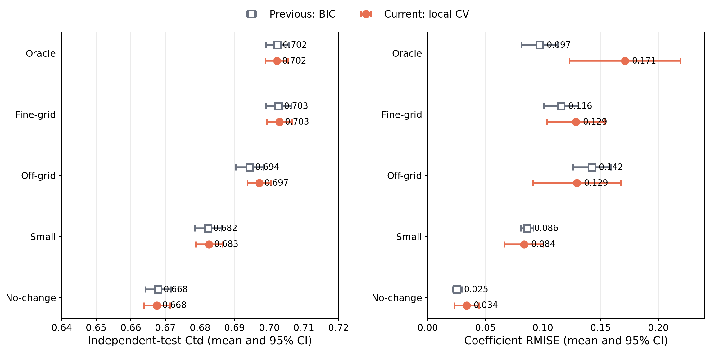
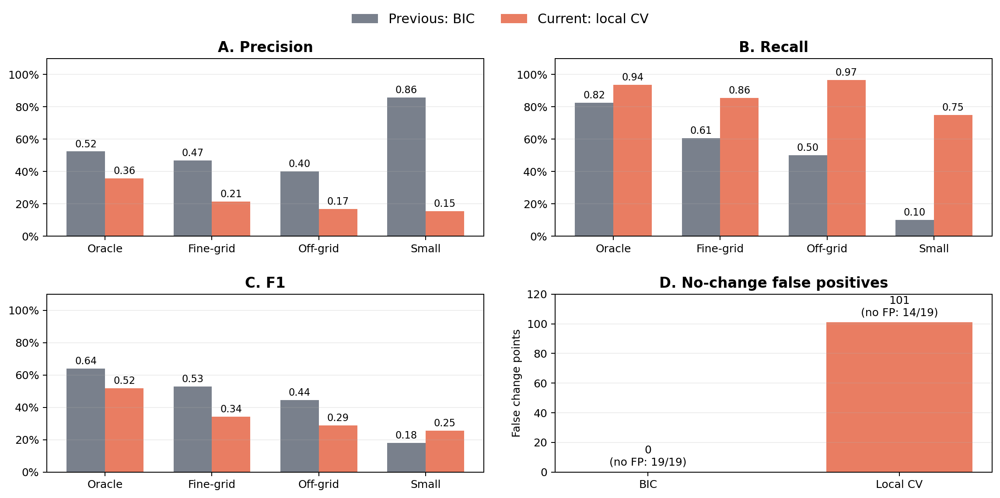

<!-- _class: lead -->

# 時間変動係数AFTモデル：進捗報告

### 2026/09/04

<!--
[Sources]
- docs/slides21_2026-08-05.md
- docs/meeting_minutes_2026-08-05.md
-->

---
<!-- _header: 前回ゼミ 課題設定-->

## 変化点を捉えられるか

提案法の主張を予測性能の大幅な改善ではなく、次の点に置いた。

**時間変動係数を区分一定で表現し、効果が変化する時点を捉えやすくする。**

提案法の評価を下記の３点にて行う

1. 不要な候補境界をfused lassoで融合できるか
2. 真の変化点がグリッド外でも係数推定はロバストか
3. 小さい変化を見逃さず、変化なしで偽陽性を増やさないか

> 真の変化点を厳密に推定するものではない。変化点がグリッド外でもロバストな推定が可能であることを目的とする。

<!--
[Sources]
- docs/meeting_minutes_2026-08-05.md sections 4, 5, 7, 10
-->

---
<!-- _header: シミュレーション設計 -->

##  効果が変化する時点を正しく捉えることができるか

| 設定 | 真の変化点 | 解析グリッド | 確認すること |
|---|---|---|---|
| Oracle | 境界と一致 | 幅1.0 | 理想条件での回復 |
| Fine-grid | 境界と一致 | 幅0.5 | 不要な境界の融合 |
| Off-grid | 1.3, 2.3, 3.2, 4.2 | 幅0.5 | グリッドずれへの頑健性 |
| Small | 境界と一致・変化量Fine-gridの半分 | 幅0.5 | 小変化の検出限界 |
| No-change | 変化なし | 幅0.5 | 偽変化点の抑制 |

<!--
[Sources]
- generation/pilot/oracle.json
- generation/pilot/fine_grid.json
- generation/pilot/off_grid.json
- generation/pilot/small.json
- generation/pilot/no_change.json
-->

前回からの変化
- 最適$\lambda$の選択基準を BICから 5-Fold CVの$C^{td}$最大に変更
- $\lambda$のテストパターンを増加

---
<!-- _header: シミュレーション設計：テストパターン -->

## 真の変化点と解析グリッドの位置関係を5条件で比較する

  <i class="legend-grid"></i>解析グリッド境界
  <i class="legend-truth"></i>真の係数変化

  
設定

時間軸（0〜6）

この条件で検査すること

  
<b>Oracle</b> <small>幅1.0</small>

  

    <i class="truth-mark" style="left:16.667%"></i><i class="truth-mark" style="left:33.333%"></i><i class="truth-mark" style="left:50%"></i><i class="truth-mark" style="left:66.667%"></i>
  

  
真の変化点が候補境界と一致する理想条件

  
<b>Fine-grid</b> <small>幅0.5</small>

  

    <i class="truth-mark" style="left:16.667%"></i><i class="truth-mark" style="left:33.333%"></i><i class="truth-mark" style="left:50%"></i><i class="truth-mark" style="left:66.667%"></i>
  

  
余分な0.5刻みの境界を融合できるか

  
<b>Off-grid</b> <small>幅0.5</small>

  

    <i class="truth-mark" style="left:21.667%"></i><i class="truth-mark" style="left:38.333%"></i><i class="truth-mark" style="left:53.333%"></i><i class="truth-mark" style="left:70%"></i>
  

  
1.3, 2.3, 3.2, 4.2：境界外でも頑健か

  
<b>Small</b> <small>幅0.5・変化量小</small>

  

    <i class="truth-mark" style="left:16.667%"></i><i class="truth-mark" style="left:33.333%"></i><i class="truth-mark" style="left:50%"></i><i class="truth-mark" style="left:66.667%"></i>
  

  
小さい係数変化をどこまで検出できるか

  
<b>No-change</b> <small>幅0.5</small>

  

  
真の変化がないとき偽陽性を抑えられるか

0123456

赤線は、少なくとも1つの係数が変化する時点を表す。Oracle／Fine-grid／Smallでは 1, 2, 3, 4、Off-gridでは 1.3, 2.3, 3.2, 4.2。

<!--
[Sources]
- generation/pilot/oracle.json
- generation/pilot/fine_grid.json
- generation/pilot/off_grid.json
- generation/pilot/small.json
- generation/pilot/no_change.json
-->

---
<!-- _header: シミュレーション設計：具体値 -->

## 実験パターンとlambda候補

### lambda候補

| 段階 | 具体的な候補 |
|---|---|
| 粗いCV（9点） | 0, 0.0001, 0.0003, 0.001, 0.003, 0.01, 0.03, 0.1, 0.25 |
| $\lambda=0$ 近傍  | 0〜0.0001：0.00001間隔 0.0001〜0.0003：0.00002間隔（計21点） |
| $\lambda=0.25$ 近傍 | 0.1〜0.25〜0.75：各対数10区間（計21点） |

<!--
[Sources]
- docs/slides21_2026-08-05.md
- generation/pilot/oracle.json
- generation/pilot/fine_grid.json
- generation/pilot/off_grid.json
- generation/pilot/small.json
- generation/pilot/no_change.json
-->

---
<!-- _header: 評価指標 -->

## 選択・推定・予測を分けて評価する

### 係数関数

離散時点における二乗誤差の平均を用いる。

$$
\mathrm{RMISE}
=\sqrt{\frac{1}{pT}\sum_{j=1}^{p}\sum_{t=1}^{T}
\left(\hat\beta_{j,t}-\beta_{j,t}\right)^2}
$$

### 予測

**実データ**：5-fold CVの各test fold上の $C^{td}$ を集計

**シミュレーション**：学習に使わないデータでの $C^{td}$

### 変化点

- precision：検出した変化のうち真の変化に対応する割合
- recall：真の変化を検出できた割合
- F1：precisionとrecallの調和平均

### ハイパラ（$\lambda$）選択

収束判定を満たした候補内でBIC最小のモデルを選ぶ

---
<!-- _header: 今回：5-fold CV選択 -->

## lambda選択をBICから5-fold CVへ変更した

  

    
9点

    
粗いlambda grid

  

  
→

  

    
21点

    
選択値周辺の局所grid

  

- 5分割の平均検証 $C^{td}$ が最大となるlambdaをデータセットごとに選択
- 正のlambdaは上下の粗い候補との間を対数間隔で各10分割
- 既存の粗いgrid結果を再利用し、追加点だけを計算

> **予測指標で選択したとき、細かいgridが独立評価と係数構造を改善するかを検証する。**

<!--
[Sources]
- scripts/pilot/generate_refined_cv_manifest.py
- scripts/pilot/aggregate_refined_cv.py
- generation/pilot/lambda_grid.json
-->

---
<!-- _header: 今回：局所fine-grid CV -->

## 局所細分により88/100データセットで選択lambdaが変わった

| シナリオ | 粗いCV：中央値 | 局所CV：中央値 | 選択変更 |
|---|---:|---:|---:|
| Oracle | 0.0300 | 0.0284 | 18/20 |
| Fine-grid | 0.0300 | 0.0300 | 18/20 |
| Off-grid | 0.0100 | 0.0173 | 18/20 |
| Small | 0.0300 | 0.0284 | 16/20 |
| No-change | 0.2500 | 0.1671 | 18/20 |

- 粗い候補の間に最適点があるケースは多く、grid細分化の必要性は確認できた
<!--
[Sources]
- outputs/pilot_cv/adaptive_rho_normalized_stagnation_escape_newton5/cv_selections.csv
- outputs/pilot_cv_refined_reaggregated/adaptive_rho_normalized_stagnation_escape_newton5/cv_selections.csv
- scripts/pilot/aggregate_refined_cv.py
-->

---
<!-- _header: 今回：予測性能と係数誤差 -->

## BICと局所CVの予測性能はほぼ同等だが、係数誤差は異なった

<!--
[Sources]
- docs/assets/slides22_pilot/refined_cv_prediction_rmise.png
- docs/assets/slides22_pilot/selected_fit_metrics.csv
- outputs/pilot_cv_refined_refit/adaptive_rho_normalized_stagnation_escape_newton5/analysis/refined_cv_prediction_rmise_summary.csv
- outputs/pilot_cv_refined_refit/adaptive_rho_normalized_stagnation_escape_newton5/analysis/refined_cv_prediction_rmise_audit.csv
- outputs/pilot_cv_refined_reaggregated/adaptive_rho_normalized_stagnation_escape_newton5/cv_selections.csv
- outputs/pilot_cv_refined_refit/adaptive_rho_normalized_stagnation_escape_newton5/refit_summary.csv
- generation/pilot/{oracle,fine_grid,off_grid,small,no_change}.json
-->

---
<!-- _header: 今回：変化点性能 -->

## CV選択はrecallを高める一方、偽陽性を増やした

| シナリオ | $n$ | Precision | Recall | F1 | 前回BICのF1 |
|---|---:|---:|---:|---:|---:|
| Oracle | 20 | 0.357 | 0.938 | 0.517 | 0.641 |
| Fine-grid | 19 | 0.213 | 0.855 | 0.341 | 0.529 |
| Off-grid | 15 | 0.169 | 0.967 | 0.287 | 0.444 |
| Small | 15 | 0.154 | 0.750 | 0.255 | 0.179 |

- Smallでは前回BICのrecall 0.10から0.75へ上昇したが、precisionは0.15
- No-changeは14/19で変化点0、残る5件で偽変化点を計101点検出
- 予測 $C^{td}$ 最大化だけでは、変化点構造の簡潔さは制御できない

同じ88組で集計。前回BICも同一seedに限定して再計算。

<!--
[Sources]
- outputs/pilot_cv_refined_refit/adaptive_rho_normalized_stagnation_escape_newton5/analysis/coarse_refined_fit_metrics.csv
- docs/assets/slides22_pilot/selected_fit_metrics.csv
- generation/pilot/{oracle,fine_grid,off_grid,small,no_change}.json
-->

---
<!-- _header: 今回：局所fine-grid CV -->

## 今回：CV選択はSmallの小変化を捉えた一方、偽陽性が増えた

<!--
[Sources]
- docs/assets/slides22_pilot/refined_cv_change_point_scores.png
- docs/assets/slides22_pilot/refined_cv_change_point_scores.csv
- scripts/pilot/plot_bic_refined_cv_change_points.py
- outputs/pilot_cv_refined_reaggregated/adaptive_rho_normalized_stagnation_escape_newton5/cv_selections.csv
- outputs/pilot_cv_refined_refit/adaptive_rho_normalized_stagnation_escape_newton5/refit_summary.csv
- generation/pilot/{oracle,fine_grid,off_grid,small,no_change}.json
-->

---
<!-- _header: 今回：局所fine-grid CV -->

## 今回：CV選択はSmallの小変化を捉えた一方、偽陽性が増えた

### 前回：BIC

| シナリオ | TN | FP | FN | TP |
|---|---:|---:|---:|---:|
| Oracle | 160 | 60 | 14 | 66 |
| Fine-grid | 499 | 52 | 30 | 46 |
| Off-grid | 390 | 45 | 30 | 30 |
| Small | 434 | 1 | 54 | 6 |
| No-change | 627 | 0 | 0 | 0 |

### 今回：局所CV

| シナリオ | TN | FP | FN | TP |
|---|---:|---:|---:|---:|
| Oracle | 85 | 135 | 5 | 75 |
| Fine-grid | 311 | 240 | 11 | 65 |
| Off-grid | 149 | 286 | 2 | 58 |
| Small | 187 | 248 | 15 | 45 |
| No-change | 526 | 101 | 0 | 0 |

<!--
[Sources]
- docs/assets/slides22_pilot/refined_cv_change_point_scores.csv
- scripts/pilot/plot_bic_refined_cv_change_points.py
- outputs/pilot_cv_refined_reaggregated/adaptive_rho_normalized_stagnation_escape_newton5/cv_selections.csv
- outputs/pilot_cv_refined_refit/adaptive_rho_normalized_stagnation_escape_newton5/refit_summary.csv
- generation/pilot/{oracle,fine_grid,off_grid,small,no_change}.json
-->

---
<!-- _header: 今回：結果の整理 -->

## Fine-grid化よりもCV選択則の特性が結果を左右した

| 問い | 今回のCV結果 | 判断 |
|---|---|---|
| 粗いlambda gridは十分か | 88/100で選択値が変化 | **局所細分は必要** |
| 独立評価を改善するか | $C^{td}$差 $+0.00013$ | **改善は確認できない** |
| 係数回復を改善するか | RMISE差 $+0.00347$ | **全体改善は確認できない** |
| 小変化を捉えるか | Recall 0.75、Precision 0.15 | 検出増加と偽陽性が併存 |
| 偽変化を抑えるか | No-changeの5/19で偽陽性 | **未達** |

