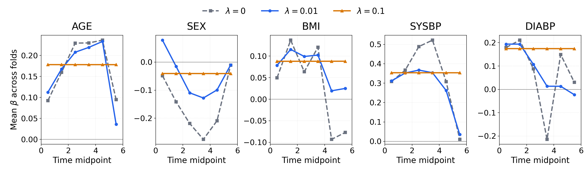
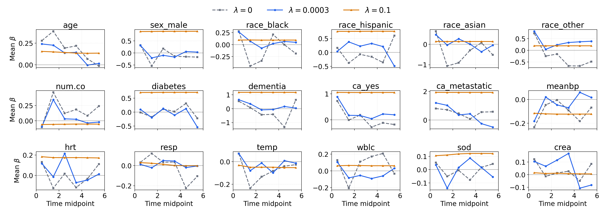

# 時間変動AFTモデルへのMCP罰則の導入

2026年9月30日 ゼミ

---
<!-- _header: 本日のトピック -->

### MCPの実装とシミュレーション

- Small設定のRecallを保ちながら偽変化点を減らせるか
- No-change設定の偽変化点を抑えられるか。
- CVとBICによる$\lambda$選択の比較

### 実データ解析

- Framingham・SUPPORT2の予測性能と、$\lambda$による係数の変化
- MIMIC-IVの解析計画と、比較対象とする既往論文に沿ったデータ定義の確認

---
<!-- _header: シミュレーション結果：変化点検出 -->
<!-- _class: figure -->

## Fused lasso と MCP の変化点検出

---
<!-- _header: シミュレーション結果：係数と予測 -->
<!-- _class: figure -->

## 係数 RMSE は低下、独立評価の $C^{\mathrm{td}}$ は同水準

---
<!-- _header: 比較結果の考察 -->

## MCPで改善した点と残る課題

- **Smallの検出精度は改善**：Recall .697 → .724、Precision .148 → .179。係数 RMISE も .101 → .074
- **No-changeの誤検出はほぼ変化なし**：偽変化点130 → 127、誤検出データ数は6/20のまま
- **Off-grid**：精度は向上するが、Recall .963 → .900
- **予測性能はほぼ同水準**：独立評価 $C^{\mathrm{td}}$ の平均差（MCP − lasso）はほぼ変化なし
- **RMSEは改善**

総じて、MCPは性能向上に寄与している。

---
<!-- _header: MCPの選択則：変化点検出 -->
<!-- _class: figure -->

## CVとBICの変化点検出

---
<!-- _header: MCPの選択則：係数と予測 -->
<!-- _class: figure -->

## CVとBICの係数 RMSE・独立評価 $C^{\mathrm{td}}$

---
<!-- _header: CVとBIC選択の考察 -->

## CVは小さい変化を拾うが、偽変化点も増える

- **選択された$\lambda$**：Smallの場合、BICで .25、CVで .03が選択された。
以前にあった通り、BICは弱い融合罰則を選びやすい
- BIC選択は精度が高いが、Recallは低い。
検出漏れより、誤検知が問題だと考えるため、BICの方が良い？

- 係数 RMSEは、CVの方が良い
  
- 予測性能 $C^{\mathrm{td}}$ の平均差は最大でも約 .0019。予測性能はほぼ同水準

---
<!-- _header: 実データ：Framingham -->
<!-- _class: figure -->

## Framingham：$\lambda$ ごとのCV性能

CV選択 $\lambda=0.01$

平均 test $C^{\mathrm{td}}=0.709$（SE 0.006）

Coxは0.708。$\lambda$ による性能差は小さい

---
<!-- _header: 実データ：Framingham -->
<!-- _class: figure -->

## Framingham：CV選択 $\lambda=0.01$ の係数

---
<!-- _header: 実データ：Framingham -->
<!-- _class: figure -->

## Framingham：$\lambda$ による係数の変化

5-fold平均の係数軌跡。$\lambda=0.1$ では全特徴量の係数がほぼ一定

平均 test $C^{\mathrm{td}}$：$\lambda=0$ で0.7083、$0.01$ で0.7092、$0.1$ で0.7083

---
<!-- _header: 実データ：SUPPORT2 -->
<!-- _class: figure -->

## SUPPORT2：$\lambda$ ごとのCV性能

CV選択 $\lambda=0.0003$

平均 test $C^{\mathrm{td}}=0.598$（SE 0.002）

Coxは0.599。選択$\lambda$での予測性能は同水準

---
<!-- _header: 実データ：SUPPORT2 -->
<!-- _class: figure -->

## SUPPORT2：CV選択 $\lambda=0.0003$ の係数

---
<!-- _header: 実データ：SUPPORT2 -->
<!-- _class: figure -->

## SUPPORT2：$\lambda$ による係数変化

5-fold平均の係数軌跡。$\lambda=0.1$ では時間変動が小さくなる

平均 test $C^{\mathrm{td}}$：$\lambda=0$ で0.5949、$0.0003$ で0.5985、$0.1$ で0.5608

---
<!-- _header: 実データ解析の計画：MIMIC-IV -->
<!-- _class: mimic -->

MIMIC-IVの実データ解析では、**既存研究で時間変動が報告されている因子**を対象に、
係数の時間構造を検討する。

Li et al. (2026)：重症虚血性脳卒中患者のスタチン使用と全死因死亡を検討した後ろ向きコホート研究

| 観点 | 原論文の設定 |
|---|---|
| P：Population | MIMIC-IV v3.1の18歳以上の虚血性脳卒中患者。初回ICU入室、滞在24時間以上 **1,964人** |
| E：Exposure | ICU入室時にスタチンを使用している患者 **1,353人**  |
| C：Comparison | ICU入室時にスタチンを使用していない患者 **611人** |
| O：Outcome | **全死因死亡**。ICU入室から死亡または打ち切りまでの時間 |

虚血性脳卒中のICU患者において、入室時のスタチン使用は、非使用と比べて全死因死亡・生存時間と
どのように関連するか。

> MIMIC-IV：米国ボストンのBeth Israel Deaconess Medical Centerの診療記録を匿名化したデータベース
> 救急部門・ICUを受診した患者の記録を収録。今回使用する **v3.1は2008–2022年が対象**
> 既往論文：Li D, Liu R, Xu H, Tong H, Chen K and Yao J (2026) Statin use and all-cause mortality in critically ill ischemic stroke patients: a time-dependent Cox analysis with external validation highlighting enhanced survival benefits in dementia subgroups.  Front. Aging Neurosci. 18:1866416. doi: 10.3389/fnagi.2026.1866416

---
<!-- _header: 実データ解析の計画：MIMIC-IV -->
<!-- _class: mimic -->

## 既往論文で報告されたスタチン係数の時間変動

- Schoenfeld残差による検定で、スタチン使用について **比例ハザード仮定**が成立しない
- スタチンと$\log(t)$の交互作用を入れ、ハザード比の時間変化を推定

$$
h(t\mid X)
=h_0(t)\exp\left[
\beta_s X_{\mathrm{statin}}
+\gamma_s X_{\mathrm{statin}}\log(t)
+\sum_{j=1}^{p}\beta_j X_j
\right]
$$

$X_{\mathrm{statin}}$は入室時のスタチン使用（1：使用、0：非使用）、$X_j$はその他の共変量（年齢・性別・人種）。

スタチンの係数は$\beta_s+\gamma_s\log(t)$として時間とともに変化する。

| 解析 | 既往論文の扱い |
|---|---|
| ICU入院から30日 | 人種で層別したCoxモデルを使用 |
| ICU入院から90日・180日・1年 | 時間変動Coxモデルを使用　**今回比較対象はこちら** |

既往論文は、スタチン使用と死亡ハザードとの関連が、時間とともに弱まる傾向を報告している。

---
<!-- _header: MIMIC-IV：提案法で調べること -->
<!-- _class: mimic -->

## 時間変動AFTモデルによる区間ごとの関連の推定

| 方法 | 時間変動の表現 | 調べること |
|---|---|---|
| 原論文の時間変動Cox | $\beta_s+\gamma_s\log(t)$ | 指定した関数形に沿ったハザード比の変化 |
| 提案する時間変動AFT | 区分一定の$\beta_{\mathrm{statin}}(t)$ | 区間ごとの係数水準と、変化点の数・位置 |

$$
\begin{aligned}
\lambda(t\mid X_i)
&=\exp\{\eta_i(t)\}\lambda_0\!\left(\exp\{\eta_i(t)\}t\right),\\
\eta_i(t)
&=-\beta_{\mathrm{statin}}(t)X_{i,\mathrm{statin}}
-\sum_{j=1}^{p}\beta_j X_{ij},\\
\beta_{\mathrm{statin}}(t)
&=\sum_{k=1}^{K}\beta_{\mathrm{statin},k}
I\!\left(t\in(\tau_{k-1},\tau_k]\right).
\end{aligned}
$$

$X_{i,\mathrm{statin}}$は入室時のスタチン使用、$X_{ij}$はその他の共変量（年齢・性別・人種）。
スタチンの係数だけを時間変動させ、その他の係数$\beta_j$は全区間で一定とする。

---
<!-- _header: MIMIC-IV：データ定義の確認 -->
<!-- _class: mimic -->

## 再解析に向けたデータ定義の確認

**原論文とEDAの保存済み出力の照合**

| 段階 | 原論文 | EDA |
|---|---:|---:|
| 成人・初回ICU | 65,366 | 65,366 |
| 脳卒中の診断抽出 | 5,279 | 5,279 |
| ICU滞在24時間以上 | 3,901 | 4,632 |
| 重要な臨床情報あり | 1,964 | 未実施 |

**脳卒中判断のICDコード**

- Liらの本文には具体的なコード一覧がない
-  一般的なIschemic strokeのICDコードでは合致しない
- 既往論文が引用するZhang et al.,（2026）の定義と一致。同じMIMIC-IVの成人ICU患者を対象とし、ICD-9/10を明記
- Wu  et al.,（2022）同じMIMIC-IVの虚血性脳卒中研究として、上記で含まれないコードを追加

Zhangは3,892人、Woは5,263人。EDAで両者の和集合を検証すると5,279人。コードと追加の経緯は次頁。

---
<!-- _header: "" -->
<!-- _footer: "" -->
<!-- _paginate: false -->

---
<!-- _header: Supplemental：Schoenfeld残差 -->
<!-- _class: mimic -->

## Schoenfeld残差の定義

Coxモデル $h(t\mid X)=h_0(t)\exp(X^\top\beta)$ を当てはめる。
時刻 $t_i$ にイベントが起きた患者 $i$ の、共変量 $k$ の残差は

$$
r_{ik}=X_{ik}-\bar X_k(t_i;\hat\beta),\qquad
\bar X_k(t_i;\hat\beta)
=\frac{\sum_{j\in R(t_i)}X_{jk}\exp(X_j^\top\hat\beta)}
{\sum_{j\in R(t_i)}\exp(X_j^\top\hat\beta)}
$$

- $R(t_i)$：直前までイベントも打ち切りも起きていない患者の集合（リスク集合）
- $\bar X_k$：リスク集合の共変量を、推定ハザードに比例する重みで平均した値
- 残差は「イベントが起きた患者の共変量 − モデルの下での期待値」
- イベントごと・共変量ごとに計算する。打ち切り患者も、打ち切り前は平均の計算に含む
- 比例ハザード性が成り立つ場合、Schoenfeld残差は0付近にばらつき、時間傾向がない

Schoenfeld (1982), Biometrika 69, 239–241。

<!--
定義の参考資料：ETH Zürich, Survival Analysis, slides 170/176.
https://ethz.ch/content/dam/ethz/special-interest/math/statistics/sfs/Education/Advanced_Studies/course-material-1921/SurvivalAnalysis/slides02-handout.pdf
Schoenfeld D. (1982). Partial residuals for the proportional hazards regression model. Biometrika 69(1), 239–241.
https://doi.org/10.1093/biomet/69.1.239
共変量は時間固定として表記。同時刻に複数のイベントがある場合は、部分尤度のタイ処理に応じて計算する。
-->
